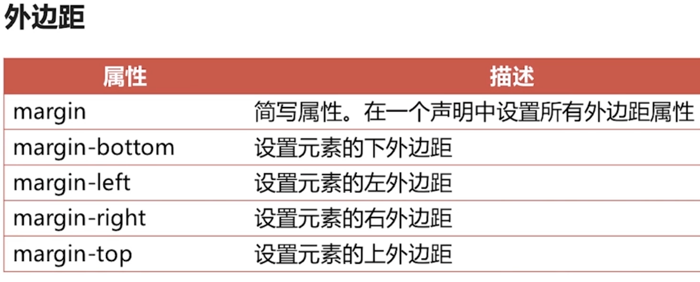
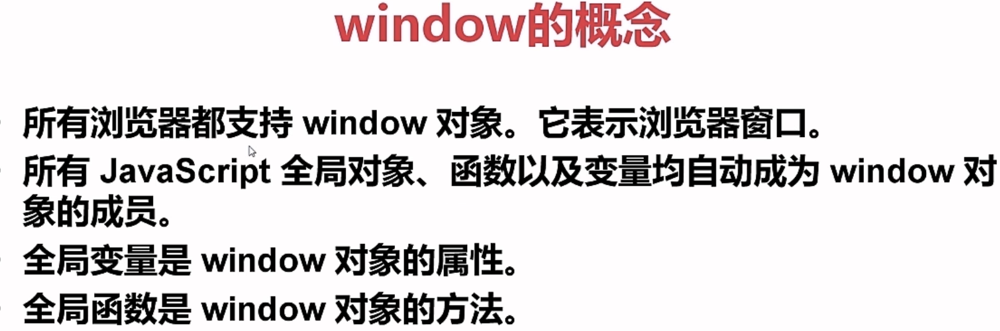
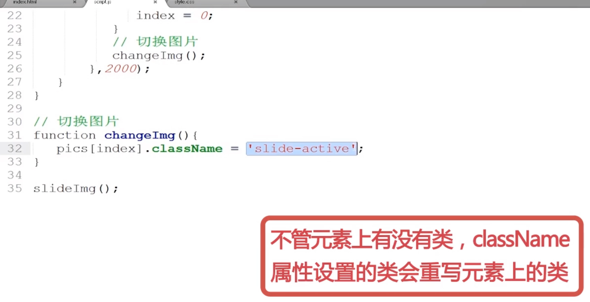
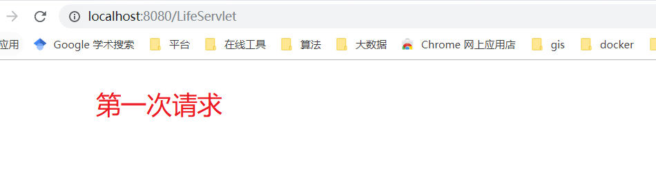
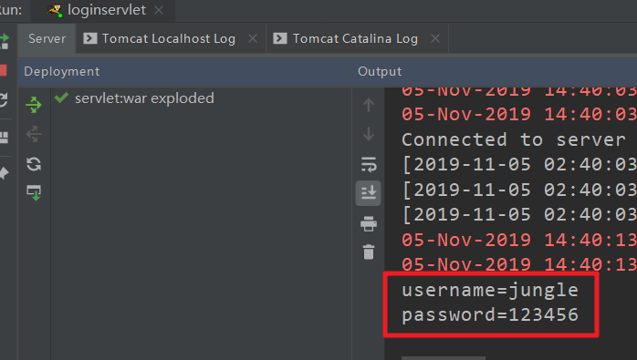
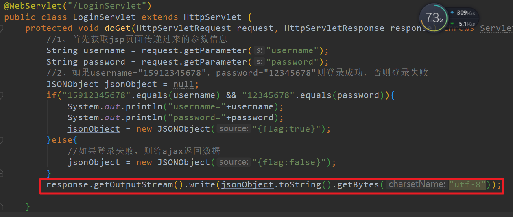

javaweb

# 步骤一：网页搭建入门

## 一、HTML入门

### 1.结构语法.html

```html
<!DOCTYPE html>
<html>
	<head>
		<meta charset="UTF-8">
		<title>html document</title>
	</head>
	<body>
		
	</body>
</html>
```

### 2.标题.html

```html
<!DOCTYPE html>
<html lang="en">
<head>
	<meta charset="UTF-8">
	<title>学习html标题</title>
</head>
<body>

	<h1>一级标题 字体大小32px</h1>
	<h2>二级标题 字体大小24px</h1>
	<h3>三级标题 字体大小18px(18.72) 约等于</h1>
	<h4>四级标题 字体大小16px</h1>
	<h5>五级标题 字体大小14px(13.28) 约等于</h1>
	<h6>六级标题 字体大小12px</h1>
	
	<h6>六级标题</h6>
	<h7>七级标题 不存在的</h7>
	<h8>八级标题 不存在的</h8>
</body>
</html>
```


## 


### 3.段落.html

```html
<!DOCTYPE html>
<html lang="en">
<head>
	<meta charset="UTF-8">
	<title>HTMl 段落标签</title>
	<style>
		p {
			margin:0;
			padding:0;
		}
	</style>
</head>
<body>
	<p>段落内容1段落内容1段落内容1段落内容1段落内容1段落内容1段落内容1段落内容1段落内容1段落内容1段落内容1段落内容1段落内容1段落内容1段落内容1段落内容1段落内容1段落内容1段落内容1段落内容1段落内容1段落内容1段落内容1段落内容1段落内容1段落内容1段落内容1段落内容1段落内容1段落内容1段落内容1段落内容1段落内容1段落内容1</p>
	<p></p>
	<p>段落内容2</p>
</body>
</html>
```

### 4.链接.html

```html
<!DOCTYPE html>
<html lang="en">
<head>
	<meta charset="UTF-8">
	<title>链接</title>
	<style>
		.content {
			height:800px;
		}

		a {
			color:#333333;
			text-decoration: none;
		}
		
		a:visited {
			color:#333333;
		}

	</style>
</head>
<body>
	<a href="http://www.imooc.com/" target="_blank">慕课网-新窗口</a>
	

	</br>
	<a href="http://www.imooc.com/" target="_self">慕课网-本窗口</a>
	</br>


	<a href="#titleThird">页面内锚点</a>
	</br>
	

	<a href="javascript:;">随便你点 能跳走算我输……</a>
	</br>
	<div class="content">一堆内容</div>
	</br>
	<h3 id="titleThird">咳咳 第三章</h3>
</body>
</html>
```


### 5.图像.html

```html
<!DOCTYPE html>
<html lang="en">
<head>
	<meta charset="UTF-8">
	<title>图像</title>
	<style>
		.imooc-logo {
			background: url(../logo.png);
			width: 200px;
			height: 80px;
		}
	</style>
</head>
<body>
	<p class="imooc-logo">
		
	</p>
</body>
</html>
```


### 6.列表.html

```html
<!DOCTYPE html>
<html lang="en">
<head>
	<meta charset="UTF-8">
	<title></title>
</head>
<body>
	<!-- 无序列表 -->
	<ul type="circle">
		<li>苹果</li>
		<li>鸭梨</li>
		<li>水蜜桃</li>
	</ul>
	<!-- 有序列表 -->
	<ol type="square">
		<li>烤冷面</li>
		<li>煎饼果子</li>
		<li>麻辣烫</li>
	</ol>

	<!-- 定义列表 -->
	<dl type="disc">
		<dt>正数</dt>
		<dd>大于0的自然数</dd>
		<dt>负数</dt>
		<dd>小于0的自然数</dd>
	</dl>
</body>
</html>
```

### 7.div.html

```html
<!DOCTYPE html>
<html lang="en">
<head>
	<meta charset="UTF-8">
	<title>div大神</title>
</head>
<body>
	<div>
		哈哈哈
	</div>
	<div>
		非常无敌好用的
	</div>
	<div>
		div
	</div>
</body>
</html>
```

### 8.块级元素与行内元素.html

```html
<!DOCTYPE html>
<html lang="en">
<head>
	<meta charset="UTF-8">
	<title>块级元素与行内元素</title>
	<style>
		.eg-to-block {
			display: block;
		}
		.eg-to-inline {
			display:inline;
		}
	</style>
</head>
<body>
	<!-- 定义
		https://www.w3.org/TR/CSS22/visuren.html#block-formatting
	-->
	<h2>1.块级元素</h2>
	<h3>(1)块级元素转换为行内元素</h3>
	<div class="eg-to-inline">
		A 想不想并排在一起
	</div>
	<div class="eg-to-inline">
		B 想啊 手牵手
	</div>

	<h3>(2)块级元素均设置了外边距 产生的叠加</h3>
	<div style="margin-bottom:50px">
		
	</div>
	<ul style="margin-top:50px">
		<li>不着边界</li>
	</ul>
	
	<h2>2.行内元素</h2>
	<p>
		<a href="#">点我跳走</a>
		<span>亮相也蛮多的标签</span>
	</p>

	<h3>(1)行内元素无法设置宽高</h3>
	<p>
		<span style="height: 1000px">我为什么不能有1000的高度呜呜</span>
	</p>

	<h3>(2)行内元素无法设置垂直方向的外边距 内边距</h3>
	<p>
		<span style="margin-top: 1000px;padding-top:200px">我为什么不能垂直的外边距呜呜</span>
	</p>

	<h3>(3)行内元素可以设置水平方向的外边距 边框 内边距</h3>
	<p>
		<span style="margin-right: 10px;padding-right:20px">旁边的小子，我要离你远点</span>
		<span>瞧不起谁呀</span>
	</p>

	<h3>(4)行内元素转换为块级元素</h3>
	<p>
		<a class="eg-to-block" href="#">我被换成块级了yeah!</a>
		<span>哎呦大哥变身了</span>
	</p>
</body>
</html>
```

### 10.注释.html

```html
<!DOCTYPE html>
<html lang="en">
<head>
	<meta charset="UTF-8">
	<title>注释</title>

</head>
<body>

	<!--<div>TODO 这里要放一个导航</div>-->
	
	<!-- 列表begin -->
	<div>
		TODO 这里要放一个列表
	</div>
	<!-- 列表end -->

	<!--[if IE 6]>
		<div>您的浏览器过于陈旧 请更新版本到最新</div>
	<![endif]-->


</body>
</html>
```


### 11-1格式化标签-字体相关.html

```html
<!DOCTYPE html>
<html lang="en">
<head>
	<meta charset="UTF-8">
	<title></title>
</head>
<body>
	<b>加粗字体</b>

	<br />

	<strong>另一种粗体</strong>

	<br />

	<big>大号字体</big>

	<br />

	<em>强调字体</em>

	<br />

	<i>斜体</i>

	<br />

	<small>小号字体</small>

	<br />

	This text contains
	<sub>下标</sub>

	<br />

	This text contains
	<sup>上标</sup>

</body>
</html>
```

### 11-2格式化标签-预格式标签.html

```html
<!DOCTYPE html>
<html lang="en">
<head>
	<meta charset="UTF-8">
	<title>预格式标签</title>
</head>
<body>
	<h1>下面为一段javascript代码</h1>
	<pre>
		var a = "";
		a = "Hello World";
		alert(a);
	</pre>
</body>
</html>
```

### 11-3格式化标签-删除线.html

```html
<!DOCTYPE html>
<html lang="en">
<head>
	<meta charset="UTF-8">
	<title>删除线</title>
</head>
<body>
	<h1>删除线</h1>
	<p>其实我有一双美丽的<del>大腿</del> <ins>请填空</ins></p>

	<p>看起来很美好 然而兼容性不好</p>
</body>
</html>
```

### 11-4格式化标签-引用.html

```html
<!DOCTYPE html>
<html lang="en">
<head>
	<meta charset="UTF-8">
	<title>格式化标签-引用</title>
</head>
<body>
	<h1>引用演示</h1>
	<blockquote>
		引用自w3c官方HTML标准文档
	</blockquote>
</body>
</html>
```

### 12-1表格-简单表格.html

```html
<!DOCTYPE html>
<html lang="en">
<head>
	<meta charset="UTF-8">
	<title>表格</title>
</head>
<body>
	<table>
		<tr>
			<th>学号</th>
			<th>姓名</th>
			<th>性别</th>
		</tr>
		<tr>
			<td>20094071305</td>
			<td>懒懒懒</td>
			<td>男</td>
		</tr>
	</table>
</body>
</html>
```

### 12-3表格-完整结构表格.html

```html
<!DOCTYPE html>
<html lang="en">
<head>
	<meta charset="UTF-8">
	<title>完整结构表格</title>
</head>
<body>
	<style>
	</style>
	<table>
		<thead>
			<tr>
				<th>学号</th>
				<th>姓名</th>
				<th>总分</th>
			</tr>
		</thead>
		<tbody>
			<tr>
				<td>20094071309</td>
				<td>兰兰懒</td>
				<td>400</td>
			</tr>
			<tr>
				<td>20094071310</td>
				<td>小新</td>
				<td>400</td>
			</tr>
		</tbody>
	</table>
</body>
</html>
```

### 12-4表格-表格重要属性.html

```html
<!DOCTYPE html>
<html lang="en">
<head>
	<meta charset="UTF-8">
	<title>表格重要属性</title>
</head>
<body>
	<table align="center" border=1 cellspacing="1">
		<tbody align="center">
			<tr >
				<td>学号</td>
				<td>姓名</td>
				<td>性别</td>
			</tr>
			<tr >
				<td>20094071309</td>
				<td>小兰</td>
				<td rowspan="2">男</td>
			</tr>
			<tr >
				<td>20094071310</td>
				<td>小新</td>
			<tr >
				<td colspan="3">按钮</td>
			</tr>
		</tbody>
		
	</table>
</body>
</html>
```


### 13-1-表单元素.html

```html
<!DOCTYPE html>
<html lang="en">
<head>
	<meta charset="UTF-8">
	<title>表单</title>
</head>
<body>
	<form action="">
		姓名<input type="text" />
		</br>
		性别<input type="radio" />男<input type="radio" />女
		</br>
		喜欢玩的游戏:
		</br>
		<input type="checkbox" />农药
		<input type="checkbox" />西游
		</br>
		学历:
		<select>
			<option value="0">函授</option>
			<option value="1">学士</option>
			<option value="2">硕士</option>
			<option value="3">非人</option>
		</select>
		</br>
		选择日期<input type="date" />
		</br>
		身高<input type="number" />
		</br>
		喜欢的颜色<input type="color" />
		</br>
		薪资<input type="range"  min="1" max="5"/>
		</br>
		联系邮箱<input type="email" />
		</br>
		小秘密<input type="password" />
		</br>
		个性签名:
		</br>
		<textarea rows="5" cols="30" ></textarea>
		</br>
		<input type="button" value="清空" />
		<input type="submit" />
	</form>
</body>
</html>
```


## 二、CSS入门


### 01.CSS声明.html

```html
<!DOCTYPE html>
<html lang="en">
<head>
    <meta charset="UTF-8">
    <title>CSS声明</title>
    <style>
        body {
            background-color: lightblue;
        }
    </style>
</head>
<body>

</body>
</html>
```


### 02.CSS引入方式一.html

```html
<!DOCTYPE html>
<html lang="en">
<head>
    <meta charset="UTF-8">
    <title>CSS引入方式一</title>
</head>
<body>
<p style="color: orange;font-weight: bold">这是一个段落内容.</p>
</body>
</html>
```

### 03.CSS引入方式二.html

```html
<!DOCTYPE html>
<html lang="en">
<head>
    <meta charset="UTF-8">
    <title>CSS引入方式二</title>
    <style>
        p {
            color: orange;
            font-weight: bold;
        }
    </style>
</head>
<body>
<p>这是一个段落内容.</p>
</body>
</html>
```

### 04.CSS引入方式三.html

```html
<!DOCTYPE html>
<html lang="en">
<head>
    <meta charset="UTF-8">
    <title>CSS引入方式三</title>
    <link rel="stylesheet" href="04.css">
</head>
<body>
<p>这是一个段落内容.</p>
</body>
</html>
```

--04.css

```css
 p {
    color: orange;
    font-weight: bold;
}
```

### 05.CSS引入方式的优先级别.html

```html
<!DOCTYPE html>
<html lang="en">
<head>
    <meta charset="UTF-8">
    <title>CSS引入方式的优先级别</title>
    <link rel="stylesheet" href="05.css">
    <style>
        p {
            color: deepskyblue;
            font-weight: normal;
        }
    </style>
</head>
<body>
<p style="color: orange;font-weight: bolder">这是一个段落内容.</p>
</body>
</html>
```

==内联优于外联==


### 06.CSS选择器.html

```html
<!DOCTYPE html>
<html lang="en">
<head>
    <meta charset="UTF-8">
    <title>CSS选择器</title>
    <style>
        /* id选择器 */
        #p {
            color: lightcoral;
            font-weight: bold;
        }
        /* class选择器 */
        .myclass {
            color: lightgreen;
            font-weight: bolder;
        }
        /* 元素选择器 */
        span {
            color: lightblue;
            font-weight: normal;
        }
        /* 属性选择器 */
        [title] {
            color: lightgray;
            font-weight: lighter;
        }
    </style>
</head>
<body>
<p id="p">这是一个段落内容.</p>
<p class="myclass">这是一个段落内容.</p>
<span>这是一段文本内容.</span>
<p title="this is p.">这是一个段落内容.</p>
</body>
</html>
```


### 07.后代选择器.html

```html
<!DOCTYPE html>
<html lang="en">
<head>
    <meta charset="UTF-8">
    <title>后代选择器</title>
    <style>
        span {
            background-color: white;
        }

        div span {
            background-color: DodgerBlue;
        }
    </style>
</head>
<body>
<div>
  <span>Span 1.
    <span>Span 2.</span>
  </span>
</div>
<span>Span 3.</span>
</body>
</html>
```

### 08.子元素选择器.html

```html
<!DOCTYPE html>
<html lang="en">
<head>
    <meta charset="UTF-8">
    <title>子元素选择器</title>
    <style>
        span { background-color: white; }
        div > span {
            background-color: DodgerBlue;
        }
    </style>
</head>
<body>
<div>
  <span>Span 1. In the div.
    <span>Span 2. In the span that's in the div.</span>
  </span>
</div>
<span>Span 3. Not in a div at all</span>
</body>
</html>
```

### 09.相邻兄弟选择器.html

```html
<!DOCTYPE html>
<html lang="en">
<head>
    <meta charset="UTF-8">
    <title>相邻兄弟选择器</title>
    <style>
        li + li {
            color: red;
        }
    </style>
</head>
<body>
<ul>
    <li>One</li>
    <li>Two</li>
    <li>Three</li>
</ul>
</body>
</html>
```

### 10.伪类.html

```HTML
<!DOCTYPE html>
<html lang="en">
<head>
    <meta charset="UTF-8">
    <title>伪类</title>
    <style>
        body { background-color: #ffffc9 }
        a:link { color: blue } /* 未访问链接 */
        a:visited { color: purple } /* 已访问链接 */
        a:hover { font-weight: bold } /* 用户鼠标悬停 */
        a:active { color: lime } /* 激活链接 */
    </style>
</head>
<body>
<p>这个链接在鼠标按下和松开的这段时间内会变成绿色: <a href="#">慕课网 imooc.com</a>.</p>
</body>
</html>
```


### 11.伪元素.html

```html
<!DOCTYPE html>
<html lang="en">
<head>
    <meta charset="UTF-8">
    <title>伪元素</title>
    <style>
        q::before {
            content: "«";
            color: blue;
        }
        q::after {
            content: "»";
            color: red;
        }
    </style>
</head>
<body>
<q>一些引用</q>, 他说, <q>比没有好。</q>.
</body>
</html>
```


### 12.选择器优先级别.html

```html
<!DOCTYPE html>
<html lang="en">
<head>
    <meta charset="UTF-8">
    <title>选择器的优先级别</title>
    <style>
        /* id选择器 */
        #p {
            color: lightcoral;
            font-weight: bold;
        }
        /* class选择器 */
        .myclass {
            color: lightgreen;
            font-weight: bolder;
        }
        /* 元素选择器 */
        p {
            color: lightblue;
            font-weight: normal;
        }
    </style>
</head>
<body>
<p id="p" class="myclass" style="color: lightslategray;font-weight: lighter">这是一个段落内容.</p>
</body>
</html>
```

### 13.背景.html

```html
<!DOCTYPE html>
<html lang="en">
<head>
    <meta charset="UTF-8">
    <title>背景</title>
    <style>
        /* 设置背景为图片，并设置大小、是否重复 */
        body {
            background-image: url("imgs/background.jpeg");
            background-repeat: no-repeat;
            background-size: 250px 142px;
        }
        /* 设置背景为纯色 */
        #p1 {
            background-color: lightblue;
        }
        /* 设置背景为图片 */
        #p2 {
            width: 20px;
            height: 20px;
            background-image: url("imgs/citypoint.png");
        }
        /* 设置背景为图片的一部分 */
        #p3 {
            width: 16px;
            height: 16px;
            background-image: url("imgs/ui-icons.png");
            background-position: -64px -80px;
        }
    </style>
</head>
<body>
<p id="p1">这是一个段落内容.</p>
<p id="p2"></p>
<p id="p3"></p>
</body>
</html>
```


### 14.文本.html

```html
<!DOCTYPE html>
<html lang="en">
<head>
    <meta charset="UTF-8">
    <title>文本</title>
    <style>
        /* 设置文本颜色 */
        #p1 {
            color: lightcoral;
        }
        /* 设置文本左对齐 */
        #p2 {
            text-align: left;
        }
        /* 设置文本居中对齐 */
        #p3 {
            text-align: center;
        }
        /* 设置文本右对齐 */
        #p4 {
            text-align: right;
        }
        /* 设置链接样式去掉下划线 */
        a {
            text-decoration: none;
        }
        /* 设置文本的缩进 */
        #p5 {
            text-indent: 50px;
        }
    </style>
</head>
<body>
<p id="p1">这是一个段落内容.</p>
<p id="p2">这又是一个段落内容.</p>
<p id="p3">这又是一个段落内容.</p>
<p id="p4">这又是一个段落内容.</p>
<a href="#">这是一个链接</a>
<p id="p5">这还是一个段落内容.</p>
</body>
</html>
```


### 15.字体.html

```html
<!DOCTYPE html>
<html lang="en">
<head>
    <meta charset="UTF-8">
    <title>字体</title>
    <style>
        /* 设置字体系列 */
        #p1 {
            font-family: "Times New Roman";
        }
        /* 设置自定义字体系列 */
        @font-face {
            font-family: 'FontAwesome';
            src: url('font/fontawesome-webfont.eot?v=3.2.1');
            src: url('font/fontawesome-webfont.eot?#iefix&v=3.2.1') format('embedded-opentype'), url('../font/fontawesome-webfont.woff?v=3.2.1') format('woff'), url('../font/fontawesome-webfont.ttf?v=3.2.1') format('truetype'), url('../font/fontawesome-webfont.svg#fontawesomeregular?v=3.2.1') format('svg');
            font-weight: normal;
            font-style: normal;
        }
        #p2 {
            font-family: FontAwesome;
        }
        #p3 {
            font-size: larger;
            font-style: italic;
        }
    </style>
</head>
<body>
<p id="p1">this is text.</p>
<p id="p2">this is text too.</p>
<p id="p3">这是一个段落内容.</p>
</body>
</html>
```


### 16.链接.html

```html
<!DOCTYPE html>
<html lang="en">
<head>
    <meta charset="UTF-8">
    <title>链接</title>
    <style>
        /* 正常，未访问过的链接 */
        a:link {
            color: lightgreen;
            /* 修改链接的文本样式 */
            text-decoration: none;
            /* 设置链接的背景颜色 */
            background-color: lightyellow;
        }
        /* 当用户鼠标放在链接上时 */
        a:hover {
            color: lightcoral;
        }
        /* 用户已访问过的链接 */
        a:visited {
            color: lightblue;
        }
        /* 链接被点击的那一刻 */
        a:active {
            color: lightslategray;
        }
    </style>
</head>
<body>
<a href="#">这是一个链接.</a>
</body>
</html>
```

### 17.列表.html

```html
<!DOCTYPE html>
<html lang="en">
<head>
    <meta charset="UTF-8">
    <title>列表</title>
    <style>
        /* 设置列表项的预定义样式 */
        #u1 {
            list-style-type: decimal;
        }
        /* 设置列表项的图片样式 */
        #u2 {
            list-style-image: url("imgs/mac.png");
        }
        /* 设置列表项水平方向排列 */
        #u3 {
            list-style-type: none;
        }
        #u3>li {
            float: left;
            display: inline-block;
            background-color: lightgreen;
            padding: 5px;
        }
    </style>
</head>
<body>
<ul id="u1">
    <li>苹果</li>
    <li>西瓜</li>
    <li>香蕉</li>
</ul>
<ul id="u2">
    <li>苹果</li>
    <li>西瓜</li>
    <li>香蕉</li>
</ul>
<ul id="u3">
    <li>苹果</li>
    <li>西瓜</li>
    <li>香蕉</li>
</ul>
</body>
</html>
```


### 18.表格.html

```html
<!DOCTYPE html>
<html lang="en">
<head>
    <meta charset="UTF-8">
    <title>表格</title>
    <style>
        table, th, td {
            border: 1px solid lightslategray;
            /*双边框变单边框*/
            border-collapse: collapse;
        }
        table {
            width: 80%;
            /*外边距*/
            margin: 0px auto;
        }
        table th {
            background-color: lightcoral;
            color: white;
        }
        table th, table td {
            /*内边距*/
            padding: 10px;
        }
        .info {
            background-color: lightgreen;
            color: white;
        }
    </style>
</head>
<body>
<table>
    <tr>
        <th>名称</th>
        <th>职位</th>
        <th>收入</th>
    </tr>
    <tr class="info">
        <td>张无忌</td>
        <td>老板</td>
        <td>100000</td>
    </tr>
    <tr>
        <td>小昭</td>
        <td>秘书</td>
        <td>10000</td>
    </tr>
    <tr class="info">
        <td>周芷若</td>
        <td>主管</td>
        <td>20000</td>
    </tr>
</table>
</body>
</html>
```


### 19.两行三列布局.html

```html
<!DOCTYPE html>
<html lang="en">
<head>
    <meta charset="UTF-8">
    <title>两行三列布局</title>
    <style>
        html, body {
            margin: 0;
        }
        header {
            height: 100px;
            background-color: lightblue;
        }
        #container {
            height: 500px;
            background-color: lightgreen;
        }
        nav {
            float: left;
            width: 150px;
            background-color: lightyellow;
            height: 100%;
        }
        aside {
            float: right;
            width: 100px;
            background-color: orange;
            height: 100%;
        }
        article {
            overflow: hidden;
            background-color: lightcoral;
            height: 100%;
        }
    </style>
</head>
<body>
<header></header>
<div id="container">
    <nav></nav>
    <aside></aside>
    <article></article>
</div>
</body>
</html>
```

### 20.三行两列布局.html

```html
<!DOCTYPE html>
<html lang="en">
<head>
    <meta charset="UTF-8">
    <title>三行两列布局</title>
    <style>
        html, body {
            margin: 0;
        }
        header {
            height: 100px;
            background-color: lightblue;
        }
        #container {
            height: 500px;
            background-color: lightgreen;
        }
        footer {
            height: 100px;
            background-color: lightslategray;
        }
        nav {
            float: left;
            width: 150px;
            background-color: lightyellow;
            height: 100%;
        }
        article {
            /*margin-left: 150px;*/
            overflow: hidden;
            background-color: lightcoral;
            height: 100%;
        }
    </style>
</head>
<body>
<header></header>
<div id="container">
    <nav></nav>
    <article></article>
</div>
<footer></footer>
</body>
</html>
```


### 24.盒子模型.html

```html
<!DOCTYPE html>
<html lang="en">
<head>
    <meta charset="UTF-8">
    <title>盒子模型</title>
    <style>
        div {
            width: 200px;
            height: 100px;
            background-color: lightgreen;

            /*黑色实线*/
            border: 10px black solid;
            /*内边距*/
            padding: 10px;
            /*外边距*/
            margin: 10px;
        }
    </style>
</head>
<body>
<div></div>
</body>
</html>
```


### 25.盒子模型的边框

```html
<!DOCTYPE html>
<html lang="en">
<head>
    <meta charset="UTF-8">
    <title>盒子模型的边框</title>
    <style>
        div {
            width: 200px;
            height: 100px;
            background-color: lightgreen;
            /*边框*/
            /*border-width: 10px;*/
            /*border-color: lightcoral;*/
            /*border-style: solid;*/


            /*简写*/
            border: 10px lightcoral solid;
        }
    </style>
</head>
<body>
<div></div>
</body>
</html>
```


### 26.盒子模型内边距

```html
<!DOCTYPE html>
<html lang="en">
<head>
    <meta charset="UTF-8">
    <title>盒子模型内边距</title>
    <style>
        #d1 {
            width: 200px;
            height: 100px;
            background-color: lightgreen;

            /*padding-top: 30px;*/
            /*padding-right: 20px;*/
            /*padding-bottom: 10px;*/
            /*padding-left: 5px;*/

            /*上，右，下，左*/
            padding: 10px 20px 30px 40px;
        }
        #d2 {
            width: 200px;
            height: 100px;
            background-color: lightcoral;
        }
    </style>
</head>
<body>
<div id="d1">
    <div id="d2"></div>
</div>
</body>
</html>
```

### 27.盒子模型外边距

```html
<!DOCTYPE html>
<html lang="en">
<head>
    <meta charset="UTF-8">
    <title>盒子模型外边距</title>
    <style>
        #d1 {
            width: 200px;
            height: 100px;
            background-color: lightgreen;

            margin: 50px;
        }
        #d2 {
            width: 200px;
            height: 100px;
            background-color: lightcoral;
        }
    </style>
</head>
<body>
<div id="d1"></div>
<div id="d2"></div>
</body>
</html>
```



## 三、Float浮动


### 1.float参数使用方法

```html
<!DOCTYPE html>
<html lang="en">
<head>
    <meta charset="UTF-8">
    <title>float参数使用方法</title>
    <style>
        *{
            padding: 0;
            margin: 0;
        }

        .test{
            width: 100px;
            height: 100px;
            background: red;
            /*可以使块水平排列*/
            float: inherit;
            margin-right: 10px;
        }

        .per{
            width: 300px;
            height: 300px;
            background: blue;
            float: right;
        }
    </style>
</head>
<body>
<div class="per">
    <div class="test">1</div>
    <div class="test">2</div>
</div>
</body>
</html>
```

### 2.float实现文字环绕图片

```html
<!DOCTYPE html>
<html lang="en">
<head>
    <meta charset="UTF-8">
    <title>float实现文字环绕图片</title>
    <style>
        *{
            padding: 0;
            margin: 0;
        }
        img{
            float: right;
        }
    </style>
</head>
<body>

慕课网是垂直的互联网IT技能免费学习网站。以独家视频教程、在线编程工具、学习计划、问答社区为核心特色。在这里，你可以找到最好的互联网技术牛人，也可以通过免费的在线公开视频课程学习国内领先的互联网IT技术。
慕课网课程涵盖前端开发、PHP、Html5、Android、iOS、Swift等IT前沿技术语言，包括基础课程、实用案例、高级分享三大类型，适合不同阶段的学习人群。以纯干货、短视频的形式为平台特点，为在校学生、职场白领提供了一个迅速提升技能、共同分享进步的学习平台。
慕课网是垂直的互联网IT技能免费学习网站。以独家视频教程、在线编程工具、学习计划、问答社区为核心特色。在这里，你可以找到最好的互联网技术牛人，也可以通过免费的在线公开视频课程学习国内领先的互联网IT技术。
慕课网课程涵盖前端开发、PHP、Html5、Android、iOS、Swift等IT前沿技术语言，包括基础课程、实用案例、高级分享三大类型，适合不同阶段的学习人群。以纯干货、短视频的形式为平台特点，为在校学生、职场白领提供了一个迅速提升技能、共同分享进步的学习平台。
慕课网是垂直的互联网IT技能免费学习网站。以独家视频教程、在线编程工具、学习计划、问答社区为核心特色。在这里，你可以找到最好的互联网技术牛人，也可以通过免费的在线公开视频课程学习国内领先的互联网IT技术。
慕课网课程涵盖前端开发、PHP、Html5、Android、iOS、Swift等IT前沿技术语言，包括基础课程、实用案例、高级分享三大类型，适合不同阶段的学习人群。以纯干货、短视频的形式为平台特点，为在校学生、职场白领提供了一个迅速提升技能、共同分享进步的学习平台。
</body>
</html>
```


### 3.float的副作用

```html
<!DOCTYPE html>
<html lang="en">
<head>
    <meta charset="UTF-8">
    <title>float的副作用</title>
    <style>
        *{
            margin: 0;
            padding: 0;
        }
        
        .per{
            width:500px;
            height: auto;
            border: 1px solid #000;
        }
        
        .test{
            width: 80px;
            height: 30px;
            background: red;
            border: 1px solid #FFF;
            float: left;
        }
        
        .bro{
            width: 100px;
            height: 100px;
            background: blue;
        }
    </style>
</head>
<body>
    <div class="per">
    <div class="test"></div>
    <div class="test"></div>
    <div class="test"></div>
    <div class="test"></div>
    </div>
    <div class="bro"></div>
</body>
</html>
```


### 4.利用给父元素添加高度解决塌陷问题

```html
<!DOCTYPE html>
<html lang="en">
<head>
    <meta charset="UTF-8">
    <title>利用给父元素添加高度解决塌陷问题</title>
    <style>
        .per{
            width: 500px;
            height: 32px;
            border: 1px solid #000;
            
        }
        
        .test{
            width: 100px;
            height: 30px;
            background: red;
            border: 1px solid #FFF;
            float: left;
        }
    </style>
</head>
<body>
    <div class="per">
        <div class="test"></div>
        <div class="test"></div>
        <div class="test"></div>
        <div class="test"></div>
        <div class="test"></div>
        <div class="test"></div>
        <div class="test"></div>
        <div class="test"></div>
        <div class="test"></div>                
    </div>
</body>
</html>
```

### 5.clear清除内部浮动导致的父元素塌陷

```html
<!DOCTYPE html>
<html lang="en">
<head>
    <meta charset="UTF-8">
    <title>clear清除内部浮动导致的父元素塌陷</title>
    <style>
        .per{
            width: 500px;
            height: auto;
            border: 1px solid #000;
        }
        
        .test{
            width: 100px;
            height: 30px;
            float: left;
            background: red;
            border: 1px solid #FFF;
        }
        
        .clear{
            clear: both;
        }
    </style>
</head>
<body>
    <div class="per">
        <div class="test"></div>
        <div class="test"></div>
        <div class="test"></div>
       <div class="test"></div>
        <div class="test"></div>
        <div class="test"></div>
       <div class="test"></div>
        <div class="test"></div>
        <div class="test"></div>                
        <div class="clear"></div>
    </div>
</body>
</html>
```


### 6.overflow实现清除浮动

```html
<!DOCTYPE html>
<html lang="en">
<head>
    <meta charset="UTF-8">
    <title>overflow实现清除浮动</title>
    <style>
        .per{
            width: 500px;
            height: auto;
            border: 1px solid #000;
            /*overflow处理溢出问题*/
            overflow: hidden;
            /*ie专用属性*/
            zoom:1;
        }
        
        .test{
            width: 100px;
            height: 30px;
            background: red;
            border: 1px solid #FFF;
            float: left;
        }
    </style>
</head>
<body>
    <div class="per">
        <div class="test"></div>
        <div class="test"></div>
        <div class="test"></div>
    </div>
</body>
</html>
```

### 7.float解决塌陷问题

```html
<!DOCTYPE html>
<html lang="en">
<head>
    <meta charset="UTF-8">
    <title>float解决塌陷问题</title>
    <style>
        .per{
            width: 500px;
            height: auto;
            border: 1px solid #000;
            float: left;
        }
        .test{
            width: 100px;
            height: 30px;
            background: red;
            border: 1px solid #FFF;
            float: left;
        }
        
        .bro{
            width: 100px;
            height: 100px;
            background: blue;
            clear: both;
        }
    </style>
</head>
<body>
    <div class="per">
        <div class="test"></div>
        <div class="test"></div>
        <div class="test"></div>
    </div>
    <div class="bro"></div>
</body>
</html>
```

### 8.导航案例

```html
<!DOCTYPE html>
<html lang="en">
<head>
    <meta charset="UTF-8">
    <title>float</title>
    <style>
        *{
            padding: 0;
            margin: 0;
        }
        
        .head{
            width: 100%;
            height: 64px;
        }
    
        .logo{
            width: 160px;
            height: 40px;
            float: left;
        }
        
        .nav{
            width: 320px;
            height: 64px;
            float: left;
        }
        
        .nav-li{
            width: 80px;
            height: 64px;
            text-align: center;
            line-height: 64px;
            color: #333;
            float: left;
        }
        
        .icons{
            width: 320px;
            height: 64px;
            float: right;
        }
        
        .i01{
            width: 64px;
            height: 64px;
            float: left;
            background: url("001.png") center center no-repeat;
        }
        
        .i02{
            width: 64px;
            height: 64px;
            float: left;
            background: url("002.png") center center no-repeat;
        }
        
        .i03{
            width: 64px;
            height: 64px;
            float: left;
            background: url("003.png") center center no-repeat;
        }
        
        .i04{
            width: 64px;
            height: 64px;
            float: left;
            background: url("004.png") center center no-repeat;
        }
        
        .i05{
            width: 64px;
            height: 64px;
            float: left;
            background: url("005.png") center center no-repeat;
        }        
    </style>
</head>
<body>
    <div class="head">
        <div class="logo">
            
        </div>
        <div class="nav">
            <div class="nav-li">实战</div>
            <div class="nav-li">路径</div>
            <div class="nav-li">猿问</div>
            <div class="nav-li">手记</div>
        </div>
        <div class="icons">
            <div class="i01"></div>
            <div class="i02"></div>
            <div class="i03"></div>
            <div class="i04"></div>
            <div class="i05"></div>
        </div>
    </div>
</body>
</html>
```

## 四.CSS定位


### 1.position-static

```html
<!DOCTYPE html>
<html lang="en">
<head>
    <meta charset="UTF-8">
    <title>position-static</title>
    <link rel="stylesheet" href="./reset.css">
    <style>
        .block {
            position: relative;
            top:10px;
            width: 50px;
            height: 50px;
            line-height: 50px;
            text-align: center;
            border: 2px solid blue;

            /*box-sizing；允许以特定的方式匹配某个区域的特定元素*/
            box-sizing: border-box;
        }

        /*nth-child(n)选择器，匹配属于其父元素的第N个子元素*/
        .block:nth-child(2){
            position: static;
            border-color:red;
        }
    </style>
</head>
<body>
    <div class="block">
        A
    </div>
    <div class="block">
        B
    </div>
    <div class="block">
        C
    </div>
    <div class="block">
        D
    </div>
</body>
</html>
```


### 2.position-relative

```html
<!DOCTYPE html>
<html lang="en">
<head>
    <meta charset="UTF-8">
    <title>position-relative</title>
    <link rel="stylesheet" href="./reset.css">
    <style>
		.parent {
			width:300px;
			height:300px;
			background: blue;
		}
		.parent div {
			width: 80px;
			height: 80px;
		}
        .sub-1 {
            /*变成可定位元素*/
        	position:relative;
        	background: red;
        	top:20px;
        	left: 50px;
        }
        .sub-2 {
			background: green;
        }

    </style>
</head>
<body>
    <div class="parent">
    	<div class="sub-1"></div>
    	<div class="sub-2"></div>
    </div>
    <div class=""></div>
</body>
</html>
```


### 3.position-absolute

```html
<!DOCTYPE html>
<html lang="en">
<head>
    <meta charset="UTF-8">
    <title>position-absolute</title>
    <link rel="stylesheet" href="./reset.css">
    <style>
        .parent {
            position: relative;
            width: 200px;
            height: 200px;
            background: red;
        }
        .sub {
            position: absolute;
            width: 50px;
            height: 50px;
        }
        .tl {
            top:0;
            left: 0;
            background: green;
        }
        .tr {
            top:0;
            right: 0;
            background: yellow;
        }
        .br {
            bottom:0;
            right: 0;
            background: black;
        }
        .bl {
            bottom:0;
            left: 0;
            background: gray;
        }
    </style>
</head>
<body>
    <div class="parent">
        <div class="sub tl"></div>
        <div class="sub tr"></div>
        <div class="sub br"></div>
        <div class="sub bl"></div>
    </div>
</body>
</html>
```


### 4.position-fixed

```html
<!DOCTYPE html>
<html lang="en">
<head>
    <meta charset="UTF-8">
    <title>position-fixed</title>
    <link rel="stylesheet" href="./reset.css">
    <style>
        .ad-right-float {
            position: fixed;
            bottom: 50px;
            right: 0;
            width: 80px;
            height: 80px;
            background: gray;
            cursor: pointer;
        }
    </style>
</head>
<body>
    <div class="ad-right-float">
        悬停广告
    </div>
</body>
</html>
```


### 5.position-sticky

```html
<!DOCTYPE html>
<html lang="en">
<head>
    <meta charset="UTF-8">
    <title>position-sticky</title>
    <link rel="stylesheet" href="./reset.css">
    <style>
        body {
            height: 800px;
            overflow: auto;
        }
        .logo {
            width: 100%;
            height: 50px;
            background: gray;
        }
        .nav {
            position: sticky;
            top:0;
            width: 100%;
            height: 50px;
            background: blue;
            color:#ffffff;
            cursor: pointer;
        }
        .con{
            height: 500px;
        }
    </style>
</head>
<body>
    <div class="con">
        <div class="logo">
            想象我是网站头图
        </div>
        <div class="nav">
            想象这里是一堆的 banner 导航按钮 | 编辑 | 发布
        </div>
    </div>
    <div>
        <p>
            假装自己是一段文字 假装自己是一段文字 假装自己是一段文字 假装自己是一段文字 假装自己是一段文字 假装自己是一段文字 假装自己是一段文字 假装自己是一段文字 
        </p>
        <p>
            假装自己是一段文字 假装自己是一段文字 假装自己是一段文字 假装自己是一段文字 假装自己是一段文字 假装自己是一段文字 假装自己是一段文字 假装自己是一段文字 
        </p>
        <p>
            假装自己是一段文字 假装自己是一段文字 假装自己是一段文字 假装自己是一段文字 假装自己是一段文字 假装自己是一段文字 假装自己是一段文字 假装自己是一段文字 
        </p>
        <p>
            假装自己是一段文字 假装自己是一段文字 假装自己是一段文字 假装自己是一段文字 假装自己是一段文字 假装自己是一段文字 假装自己是一段文字 假装自己是一段文字 
        </p>
        <p>
            假装自己是一段文字 假装自己是一段文字 假装自己是一段文字 假装自己是一段文字 假装自己是一段文字 假装自己是一段文字 假装自己是一段文字 假装自己是一段文字 
        </p>
        <p>
            假装自己是一段文字 假装自己是一段文字 假装自己是一段文字 假装自己是一段文字 假装自己是一段文字 假装自己是一段文字 假装自己是一段文字 假装自己是一段文字 
        </p>
        <p>
            假装自己是一段文字 假装自己是一段文字 假装自己是一段文字 假装自己是一段文字 假装自己是一段文字 假装自己是一段文字 假装自己是一段文字 假装自己是一段文字 
        </p>
    </div>
</body>
</html>
```


盒子


### 弹出层案例

```html
<!DOCTYPE html>
<html lang="en">
<head>
    <meta charset="UTF-8">
    <title>弹出层案例</title>
    <style>
        *{
            padding: 0;
            margin: 0;
        }
        
        html, body{
            width: 100%;
            height: 100%;
        }
        
        .content{
            width: 100%;
            height: 4043px;
            background: url("mooc.png") center top no-repeat;
        }
        
        .login{
            width: 360px;
            height: 362px;
            background: url("login.png") no-repeat;
            z-index: 2;
            position: fixed;
            left: 50%;
            top: 50%;
            margin-top: -181px; 
            margin-left: -180px; 
        }

        /*设置遮罩，防止无序点击*/
        .opacity_{
            width: 100%;
            height: 100%;
            background: url("opacity.png");
            position: fixed;
            left: 0px;
            top: 0px;
            z-index: 0;
        }
    </style>
</head>
<body>
    <div class="content"></div>
    <div class="login"></div>
    <div class="opacity_"></div>
</body>
</html>
```

### 侧边栏导航跟随案例

```html
<!DOCTYPE html>
<html lang="en">
<head>
    <meta charset="UTF-8">
    <title>侧边栏导航跟随案例</title>
    <style>
        *{
            padding: 0;
            margin: 0;
        }
        .page{
            width: 100%;
            height: 4043px;
            background: url("mooc.png") center top no-repeat;
        }
        
        .nav{
            width: 160px;
            height: 205px;
            position: fixed;
            left: 0;
            top: 50%;
            margin-top: -103px;
            font-family: 'Miscrosoft YaHei';
        }
        
        .nav-li{
            width: 160px;
            height: auto;
            border-bottom: 1px solid #FFF;
            background: #333;
            text-align: center;
            line-height: 40px;
            color: #FFF;
            font-size: 16px;

            /*鼠标形状*/
            cursor: pointer;
        }
        
        .tit{
            width: 160px;
            height: 40px;
        }
        
        .nav-li:hover ul{
            display: block;
        }
        
        .nav-li ul{
            width: 160px;
            height: auto;
            background: #FFF;
            /*展示形式开始为隐藏*/
            display: none;
        }
        
        .nav-li ul li{
            width: 160px;
            height: 40px;
            border-bottom: 1px dashed #666;
            color: #333;
            text-align: center;
            line-height: 40px;
            position: relative;
        }
        
        .nav-li ul li:hover .list-3{
            display: block;
        }
        
        .list-3{
            width: 160px;
            height: auto;
            position: absolute;
            left: 160px;
            top: 0px;
            display: none;
        }
        
        .list-3Dom{
            width: 160px;
            height: 40px;
            background: #444;
            border-bottom: 1px solid #FFF;
            text-align: center;
            line-height: 40px;
            color: #FFF;
        }
        
    </style>
</head>
<body>
    <div class="page">
        <div class="nav">
            <div class="nav-li">
                 <div class="tit">慕课网的标题</div>
                 <ul>
                     <li>
                         二级栏目
                         <div class="list-3">
                             <div class="list-3Dom">三级栏目</div>
                             <div class="list-3Dom">三级栏目</div>
                             <div class="list-3Dom">三级栏目</div>                                                          
                         </div>
                     </li>
                     <li>
                         二级栏目
                         <div class="list-3">
                             <div class="list-3Dom">三级栏目</div>
                             <div class="list-3Dom">三级栏目</div>
                             <div class="list-3Dom">三级栏目</div>                                                          
                         </div>
                     </li>
                     <li>
                         二级栏目
                         <div class="list-3">
                             <div class="list-3Dom">三级栏目</div>
                             <div class="list-3Dom">三级栏目</div>
                             <div class="list-3Dom">三级栏目</div>                                                          
                         </div>
                     </li>                                 
                 </ul>     
            </div>
            <div class="nav-li">
                 <div class="tit">慕课网的标题</div>
                 <ul>
                     <li>
                         二级栏目
                     </li>
                     <li>
                         二级栏目
                     </li>
                     <li>
                         二级栏目
                     </li>                                  
                 </ul>     
            </div>
            <div class="nav-li">
                 <div class="tit">慕课网的标题</div>
                 <ul>
                     <li>
                         二级栏目
                     </li>
                     <li>
                         二级栏目
                     </li>
                     <li>
                         二级栏目
                     </li>                                  
                 </ul>     
            </div>
            <div class="nav-li">
                 <div class="tit">慕课网的标题</div>
                 <ul>
                     <li>
                         二级栏目
                     </li>
                     <li>
                         二级栏目
                     </li>
                     <li>
                         二级栏目
                     </li>                                  
                 </ul>     
            </div>
            <div class="nav-li">
                 <div class="tit">慕课网的标题</div>
                 <ul>
                     <li>
                         二级栏目
                     </li>
                     <li>
                         二级栏目
                     </li>
                     <li>
                         二级栏目
                     </li>                                  
                 </ul>     
            </div>                                    
        </div>
    </div>
 
</body>
</html>
```

## 五、网页布局案例

### --index.css

```css
/*清除默认值*/
*{
    padding: 0;
	margin:0;
}
.header{
	width: 100%;
	height: 100px;
}
.header  img{
	width:300px;
	height: 85px;
    padding-left:100px;
	padding-top: 8px;

}
.header .logo {
    float: left;
}
.header .nav {
    float: right;
}
.header .nav ul {
 margin-right: 100px;
}
.header .nav ul li{
    float: left;
    /*list-style 简写属性在一个声明中设置所有的列表属性*/
    list-style: none;
    width: 80px;
    height: 100px;
    line-height:100px;
    font-size:15px ;
    font-weight: bolder;
    color: #7D7D7D;
}
.main .top{
    width: 100%;
    height: 600px;
}
.main .top img{
    width: 100%;
    height: 600px;
}
.main .topLayer{
    position: absolute;
    top: 100px;
    left: 0;
    background-color:#000;
    width: 100%;
    height: 600px;
    /*透明图*/
    opacity: 0.5;
}
.main .topLayer-top{
    width: 500px;
    height: 300px;
    position: absolute;
    top:400px;
    margin-top: -150px;

    /*z-index 属性指定一个元素的堆叠顺序。*/
    /*拥有更高堆叠顺序的元素总是会处于堆叠顺序较低的元素的前面。*/
    z-index: 2;
    right:50% ;
    margin-right: -250px;
}
.main .topLayer-top .word{
    padding-top: 100px;
    color: #fff;
    font-size: 45px;
    font-weight: bolder;
    text-align: center;
    font-family: "微软雅黑";
}

.main .topLayer-top button{
    width:200px;
    height: 60px;
    margin-top: 50px;
    color: #fff;
    background-color:#F5704F ;
    font-family: "微软雅黑";
    text-align: center;
    font-weight: bolder;
    font-size: 14px;
    /*设置圆角*/
    border-radius:8px ;
    margin-left: 150px;
}


.main .middle{
    width: 1000px;
    margin: 0 auto;
}
.main .middle .m-top .commen{
    float:left;
    /*平均分成3分*/
    width: 33.3%;
    padding-top: 50px;
    text-align: center;
}
.main .middle .m-top .commen img{
    width: 100px;
    height:100px;
}
.main .middle .m-top .commen .comm{
    font-size: 20px;
    color:#7D7C7F;
    font-weight: bold;
    padding-top: 20px;
}
.main .middle .m-middle{
    font-size: 22px;
    color: #E19796;
    font-weight: bold;
    padding-top: 50px;
    font-style:italic;
    text-align: center;
    padding-bottom: 50px;
}

/*清除浮动*/
.clear{
    /*指定段落的左侧或右侧不允许浮动的元素：*/
    clear: both;
}
.main .middle .m-bottom .m-com{
    /*相同的元素放置在父级元素中*/
     float: left;
     padding: 10px;
    text-align: center;
    font-weight: bold;
    font-size: 20px;
 }
.main .middle .m-bottom .m-com img {
    width:310px;
    height: 260px;
}
.main .middle .m-bottom .des1{
    color:#7D7D7F;
    padding-top: 20px;
}
.main .middle .m-bottom .des2 {
    padding-top: 10px;
    color: #BDBDBC;
}
.main .bottom {
    background-color: #F9F9F9;
}
.main .bottom .content {
    width:1000px ;
    margin: 0 auto;
}
.main .bottom .content .titile{
    text-align: center;
    font-size: 20px;
    font-weight: bold;
    color: #7D7C7F;
    font-family: "微软雅黑";
    padding-top:50px;
    padding-bottom: 50px;
}
.main .bottom .content .pic-content dl {
    float: left;
    width:470px;
    margin: 10px 12px;
}
.main .bottom .content .pic-content dl img {
    width:470px;
    height: 460px;

}
.main .bottom .content .pic-content dl .word {
    padding-top:20px;
    font-size: 20px;
    font-weight: bold;
    color:#7D7C7F;
    padding-bottom: 50px;
}
.footer{
    width: 100%;
    height: 100px;
    background-color: #292C35;
    color: #ffffff;
    text-align: center;
    line-height: 100px;
    font-family: "微软雅黑";
    font-size: 15px;
}

```

### --index.html

```html
<!DOCTYPE html>
<html>
<head>
	<meta charset="utf-8" />
	<title>CSS网页布局</title>
	<link rel="stylesheet" href="css/index.css">
	
</head>
<body>
<!-- 头部 -->
	<div class="header">
		<div class="logo">
            
        </div>
		<div class="nav">
			<ul>
				<li>手记</li>
				<li>视频</li>
				<li>图片</li>
				<li>首页</li>
			</ul>
		</div>
	</div>
	<!-- 主体 -->
    <div class="main">
        <div class="top">
            
        </div>
        <!-- 遮罩层 -->
        <div class="topLayer">

        </div>
        <!-- 最上层的内容 -->
        <div class="topLayer-top">
            <div class="word">MY BEAUTIFUL LIFE</div>
<!--            &gt 大于号-->
            <button>LOOK MORE &gt;</button>
        </div>

        <div class="middle">
            <div class="m-top">
                <div class="commen weibo">
                    
                    <div class="comm">MICROBLOG</div>
                </div>
                <div class="commen weixin">
                    
                    <div class="comm">WECHAT</div>
                </div>
                <div class="commen qq">
                    
                    <div class="comm">QQ</div>
                </div>
                <div class="clear"></div>
            </div>
            <div class="m-middle">
                "I want to give good things to record down,<br>after the recall will be very beautiful."
            </div>
            <div class="m-bottom">
                <div class="m-com">
                    
                    <div class="des1">Cool Image</div>
                    <div class="des2">Record The Picture</div>
                </div>
                <div class="m-com">
                    
                    <div class="des1">Great Picture</div>
                    <div class="des2">Record The Picture</div>
                </div>
                <div class="m-com">
                    
                    <div class="des1">Cool Image</div>
                    <div class="des2">Record The Picture</div>
                </div>
            </div>
        </div>
        <div class="clear"></div>
        <div class="bottom">
          <div class="content">
            <div class="titile">FROM THE PHOTO ALBUM</div>
            <!-- 图文混排-->
            <div class="pic-content">
                <dl>
                    <dt></dt>
                    <dd class="word">
                        Life is like a book, just read more and more refined, more write more carefully. When read, mind open, all things have been indifferent to heart. Life is the precipitation.
                    </dd>
                </dl>
                <dl>
                    <dt></dt>
                    <dd class="word">
                        Life is like a cup of tea, let people lead a person to endless aftertastes. You again good taste, it will always have a different taste, different people will have different taste more.
                    </dd>
                </dl>
            </div>
              <div class="clear">
              </div>
          </div>
        </div>
    </div>
	<!-- 底部 -->
<div class="footer">
    © 2016 imooc.com  京ICP备13046642号
</div>
</body>
</html>
```

---

## 六、JavaScript入门

### 1.js输出


```html
<!DOCTYPE html>
<html lang="en">
<head>
	<meta charset="UTF-8">
	<title>js输出</title>
</head>
<body>
	<p id="one"></p>
	<script type="text/javascript">
		/**
		window.alert() 警告框
		document.write() 写到 HTML 文档中
		innerHTML 写到 HTML 元素
		console.log() 写到浏览器的控制台
		**/

		// alert('helloworld');

		// document.write('helloworld');

		// document.getElementById('one').innerHTML = "this is p";

		console.log(123)
	</script>
</body>
</html>
```

### 2.js语句与注释


```html
<!DOCTYPE html>
<html lang="en">
<head>
	<meta charset="UTF-8">
	<title>js语句与注释</title>
</head>
<body>
	<script type="text/javascript">
		/**
		 * 分号
		   JavaScript 代码
		   JavaScript 语句标识符。 var、if、for等等
			代码块    function x(){}
			单行和多行注释
		 */
		
		// 以下代码仅供参考
		var a = 1;

		function b(){
			var c = 1;
			var d = 2;

		}

		b();

		/**
		 * 1、很好
		 * 2、非常好
		 *
		 *
		 *
		 * 
		 */
	</script>
</body>
</html>

```

### 3.js数据类型


```html
<!DOCTYPE html>
<html lang="en">
<head>
	<meta charset="UTF-8">
	<title>js数据类型</title>
</head>
<body>
	<script type="text/javascript">
		/**
		 * 字符串 (String)
		 * 数字 (Number)
		 * 布尔 (Boolean)
		 * 数组 (Array)
		 * 对象 (Object)
		 * 空 (Null)
		 * 未定义 (Undefined)
		 */
		

		// var可以声明各种类型
		var x;               // x 为 undefined
		var y = 5;           // y 为数字
		var z = "John";      // z 为字符串


		// 字符串
		var carname="Volvo XC60";
		var carname='Volvo XC60';

		// 数字
		var x1=34.00;      //使用小数点来写
		var x2=34;         //不使用小数点来写


		// 布尔
		var x=true;
		var y=false;


		// 数组
		var cars=new Array();
		cars[0]="Saab";
		cars[1]="Volvo";

		var cars=new Array("Saab","Volvo","BMW");

		var cars=["Saab","Volvo","BMW"];


		// JavaScript 对象   键值对
		var person={
			firstname:"John", 
			lastname:"Doe", 
			id:5566
		};

		//取值
		console.log(person.firstname)
		console.log(person["firstname"])

		// Undefined 和 Null
		// Undefined 这个值表示变量不含有值。
		// 可以通过将变量的值设置为 null 来清空变量
		var persons;
		var car="Volvo";
		car=null
	</script>
</body>
</html>

```

### 4.js变量


```html
<!DOCTYPE html>
<html lang="en">
<head>
	<meta charset="UTF-8">
	<title>js变量</title>
</head>
<body>
	<script type="text/javascript">
		/**
		 *  变量必须以字母开头    
			变量也能以 $ 和 _ 符号开头（不过我们不推荐这么做）  
			变量名称对大小写敏感（y 和 Y 是不同的变量）
		 * 
		 */
		
		// var a = 1; 

		// var a1 = 4;

		// var $a = 5;

		// var _a = 6;

		// var a = 55;
		// var A = 66;

		// console.log('a:', a);
		// console.log('A:', A);

		var a1 = 4, $a = 5, _a = 6;
	</script>
</body>
</html>
```

### 5.js函数


```html
<!DOCTYPE html>
<html lang="en">
<head>
	<meta charset="UTF-8">
	<title>js函数</title>
</head>
<body>
	<script type="text/javascript">

		/**
		 *  函数是由事件驱动的或者当它被调用时执行的可重复使用的代码块
			function  a( 参数 ){}   声明会前置
			var  a  =  function( 参数 ){}  匿名函数
			函数中的 return
		 *
		 *
		 *
		 * 
		 */
		
		// function a(){
		// 	console.log(1111);
		// 	console.log(2222);
		// 	console.log(3333);
		// 	console.log(4444);
		// 	console.log(5555);
		// 	console.log(6666);
		// }

		// a();
		// a();
		// a();
		// a();


		b('hello', 'world');
		// console.log(2222)
		// var cc = 123;


		function b(cs1, cs2){
			console.log(cs1, cs2);
		}


		var c = function(cs1, cs2, cs3){
			console.log(cs1, cs2, cs3);
		}

		c(1,2,3);


		function d(){
			return "this is return function";
		}

		var d1 = d();
		console.log('this is a d1: ',  d1);
	</script>
</body>
</html>
```

### 6.js运算符


```html
<!DOCTYPE html>
<html lang="en">
<head>
	<meta charset="UTF-8">
	<title>js运算符</title>
</head>
<body>
	<script type="text/javascript">
		/**
		 *  赋值运算符  =   +=   -= 等
			算术运算符  +  -   *   / 等
			字符串的 + 运算符 
		 *
		 *
		 * 
		 */

		var a = 1; 
		a += 3;   // a = a + 3;
		console.log(a);

		var b = 2;
		b = b * 3; 
		console.log(b);


		var c = 'hello';
		var d = 'world';
		var e = c + d;
		console.log(e);
	</script>
</body>
</html>
```

### 7.js比较与逻辑运算符

```html
<!DOCTYPE html>
<html lang="en">
<head>
	<meta charset="UTF-8">
	<title>js比较与逻辑运算符</title>
</head>
<body>
	<script type="text/javascript">
		/**
		 *
		 *	<  小于 
			>  大于
			==  等于 1 == ‘1’ 
			===  绝对等于（值和类型均相等）
			!=  不等于
			&&  and   1) true && true 返回 true   2)true  && false 返回false
			||  or    1) true || false 返回 true  2) false || false 返回false
		 *
		 * 
		 */
		

		// console.log(5 == 5);
		// console.log(5 == '5'); //不绝对相等 true
		// console.log(5 === 5);
		// console.log(5 === '5');
		

		// console.log(5 != 4);

		// console.log(5 == 5 && 6 == 6);
		// console.log(5 == 4 && 6 == 6);
		 
		
		console.log(5 == 5 || 6 == 5);  // true
		console.log(4 == 3 || 2 == 1);  // false
	</script>
</body>
</html>
```

### 8.js条件语句与switch语句


```html
<!DOCTYPE html>
<html lang="en">
<head>
	<meta charset="UTF-8">
	<title>js条件语句与switch语句</title>
</head>
<body>
	<script type="text/javascript">
		/**
		 * if
		 * switch
		 * 
		 */

		// var a = 13;
		
		// if( a < 4 ){
		// 	console.log('条件成功~~');
		// }


		// if(a < 6){

		// }else if(a > 8){
		// 	console.log('a > 8执行了~~')
		// } 

		// if(a < 6){
		// 	console.log('执行了a < 6')
		// }else if(a < 8 ){
		// 	console.log('执行了a < 8')
		// }else{
		// 	console.log('执行了else')
		// }


		var a = 1;

		switch(a){
			case 1:
				console.log('a = 1'); 
			case 2:
				console.log('a = 2'); 
			break;
			default:
				console.log('a = default');
		}
	</script>
</body>
</html>
```

### 9.js中for循环与while循环


```html
<!DOCTYPE html>
<html lang="en">
<head>
	<meta charset="UTF-8">
	<title>js中for循环与while循环</title>
</head>
<body>
	<script type="text/javascript">
		/**
		 *
		 *  for - 循环代码块一定的次数
			for/in - 循环遍历对象
			while - 当指定的条件为 true 时循环指定的代码块
		 */
		
		for( var i = 0; i < 10 ; i++ ){
			console.log('i:'+ i);
		}

		var person = {
			name : 'json',
			age : 25,
			sg: 170
		}

		for( key in person ){
			console.log(person[key])
		}

		var count = 1;
		while( count < 10 ){
			count++ ;
			console.log('执行while循环');
		}
	</script>
</body>
</html>
```

### 10.js Break 和 Continue 语句


```html
<!DOCTYPE html>
<html lang="en">
<head>
	<meta charset="UTF-8">
	<title>js Break 和 Continue 语句</title>
</head>
<body>
	<script type="text/javascript">
		/**
		 *  break 语句可用于跳出循环
			continue 语句跳出本次循环，继续执行
		 */
		
		// for (var i=0;i<10;i++){
		//     if (i==3)
		//     {
		//         break;
		//     }
		//     console.log( "The number is " + i + "<br>");
		// }


		for (var i=0;i<10;i++){
		    if (i==3){ 
		    	continue;
		    }
		    console.log("The number is " + i + "<br>");
		}
	</script>
</body>
</html>
```

### 11.dom简介


```html
<!DOCTYPE html>
<html lang="en">
<head>
	<meta charset="UTF-8">
	<title>Dom简介</title>
</head>
<body>
	<!-- 
		<div id="intro"></div>
		<div id="main">
			<p>The DOM is very useful.</p>
		</div>
		<div class="content"></div>

		var x=document.getElementById("intro");
		var x=document.getElementById("main");
		var y=x.getElementsByTagName("p");
		var content = document.getElementsByClassName("content");
	 -->
	<div id="intro">helloworld</div>


	<div id="main">
		<p>The DOM is very useful.</p>
	</div>

	<div class="content">1</div>
	<div class="content">2</div>
	<div class="content">3</div>
	<div class="content">4</div>

	<script type="text/javascript">
		// 通过js获取html标签
		var intro = document.getElementById("intro");  // 通过id找html，唯一的


		var main = document.getElementById("main");
		var p = main.getElementsByTagName("p")[0];

		var content1 = document.getElementsByClassName("content")[0];
	</script>
</body>
</html>
```

### 12.Dom html


```html
<!DOCTYPE html>
<html lang="en">
<head>
	<meta charset="UTF-8">
	<title>Dom html</title>
</head>
<body>
	<div id="main" data="nihao">123</div>

	

	<a id="goUrl" href="">调到百度</a>
	<script type="text/javascript">
		var main = document.getElementById("main");
		main.innerHTML= 'helloWorld';

		/**
		 *		element.getAttribute()
				element.setAttribute()   // 添加或者修改
				element.src
				element.href 

		 * 
		 */
		
		// alert(main.getAttribute("data"));

		main.setAttribute("data", "buhao");
		main.setAttribute("dd", "ddname");

		var image = document.getElementById("image");
		image.src = "2.jpg";

		var goUrl = document.getElementById("goUrl");
		goUrl.href = "http://www.baidu.com"
	</script>
</body>
</html>
```

### 13.Dom css


```html
<!DOCTYPE html>
<html lang="en">
<head>
	<meta charset="UTF-8">
	<title>Dom css</title>
</head>
<body>
	<div id="main">helloworld</div>
	<script type="text/javascript">
		var main = document.getElementById("main");
		main.style.color = "blue";
		main.style.fontSize = "100px";
	</script>
</body>
</html>
```

### 14.Dom 事件


```html
<!DOCTYPE html>
<html lang="en">
<head>
	<meta charset="UTF-8">
	<title>Dom 事件</title>
</head>
<body>
	<!-- 
		1、元素
		2、动作
		3、触发的结果


		1）事件内嵌元素中 

		2）Element.onclick=function(){displayDate()};

		3）Element.addEventListener("click", function(){
		      
		      });
	 -->
	<div onclick="alert('helloworld')">按钮</div>


	<div id="main">我是main</div>


	<div id="btn">我是btn</div>

	<script type="text/javascript">
		var main = document.getElementById("main");
		main.onclick = function(){
			alert("main被触发了");
		}


		var btn = document.getElementById("btn");
		btn.addEventListener("click", function(){
			alert("btn被触发了");
		});
	</script>
</body>
</html>
```

### 15.Dom 节点


```html
<!DOCTYPE html>
<html lang="en">
<head>
	<meta charset="UTF-8">
	<title>Dom 节点</title>
</head>
<body>
	<div id="div1">
		<p id="p1">我是第一个p</p>
		<p id="p2">我是第二个p</p>
	</div>
	<script type="text/javascript">
		/**
		 *		document.createElement("p")  
				document.createTextNode("新增")
				parent.appendChild(child);
				parent.removeChild(child);
		 * 
		 */

		var p = document.createElement("p"); // <p></p>  
		var word = document.createTextNode("我是新增的p标签");  // 我是新增的p标签

		p.appendChild(word);  //<p>我是新增的p标签</p>


		var div1 = document.getElementById("div1");
		div1.appendChild(p);  


		var p1 = document.getElementById("p1");
		div1.removeChild(p1);
	</script>
</body>
</html>
```

### 16.Js window




```html
<!DOCTYPE html>
<html lang="en">
<head>
	<meta charset="UTF-8">
	<title>Js window</title>
</head>
<body>
	<button onclick="openwindow()">创建窗口</button>
	<button onclick="myFunction()">调整窗口</button>
	<button onclick="moveFunction()">移动窗口</button>
	<button onclick="closeFunction()">关闭窗口</button>
	
	<script type="text/javascript">
		var w;
		
		function openwindow(){
			//参数1 链接 参数2 名字 可省略
			w=window.open('','', 'width=300,height=300');
		}


		function myFunction(){
			w.resizeTo(500,500);
			// 聚焦
			w.focus();
		}
		

		function moveFunction(){
			w.moveTo(700,500);
			w.focus();
		}
		

		function closeFunction(){
			w.close(700,500);
			w.focus();
		}
	</script>
</body>
</html>
```

### 17.window screen


```html
<!DOCTYPE html>
<html lang="en">
<head>
	<meta charset="UTF-8">
	<title>window screen</title>
</head>
<body>
	<script type="text/javascript">
		/**
		 *	screen.availWidth - 可用的屏幕宽度
			screen.availHeight - 可用的屏幕高度
			1920 * 1080
		 * 
		 */
		
		alert(screen.availWidth);

		alert(screen.availHeight);

	</script>
</body>
</html>
```

### 18.window location


### 19.window history


```html
<!DOCTYPE html>
<html lang="en">
<head>
	<meta charset="UTF-8">
	<title>window history</title>
</head>
<body>
	<script type="text/javascript">
		/**
		 *  window.history 对象在编写时可不使用 window 这个前缀
			history.back() - 与在浏览器点击后退按钮相同
			history.forward() - 与在浏览器中点击按钮向前相同
			history.go()
		 */

		history    
		1、前端开发
		2、后端开发     
		3、移动开发    当前页面

		history.go(-2)
	</script>
</body>
</html>
```


## 七、JavaScript实现轮播特效

### 1.position

**relative**：定位是相对于自身位置定位（设置偏移量的时候，会相对于自身所在的位置偏移）。设置了 relative 的元素仍然处在文档流中，元素的宽高不变，设置偏移量也不会影响其他元素的位置。最外层容器设置为 relative 定位，在没有设置宽度的情况下，宽度是整个浏览器的宽度。

**absolute**：定位是相对于离元素最近的设置了绝对或相对定位的父元素决定的，如果没有父元素设置绝对或相对定位，则元素相对于根元素即 html 元素定位。设置了 absolute 的元素脱了了文档流，元素在没有设置宽度的情况下，宽度由元素里面的内容决定。脱离后原来的位置相当于是空的，下面的元素会来占据位置。

**总结：**标准流盒子，低于浮动的盒子，浮动的盒子又低于定位的盒子。

定位高于浮动，浮动高于标准流。（高低和占不占位置无关）

用法：

1、必须有定位。（除去static之外）。

2、给定 z-index 的值为层级的值。（不给默认为0）

- a. 层级为0的盒子，也比标准流和浮动高。
- b. 层级为负数的盒子，比标准流和浮动低。
- c. 层级不取小数）
- d. 层级一样，后面的盒子比前面的层级高。
- e. 浮动或者标准流的盒子，后面的盒子比前面的层级高。
- f. abselute是不占位置的，relative是站位的的。而层级的高低，是和占不占位置没有关系的。

### 2.定时

 setInterval() 方法可按照指定的周期（以毫秒计）来调用函数或计算表达式。 

 setTimeout() 方法用于在指定的毫秒数后调用函数或计算表达式。

### 3.dom

 className 属性设置或返回元素的 class 属性。  




### 4.JavaScript this 关键字

面向对象语言中 this 表示当前对象的一个引用。

但在 JavaScript 中 this 不是固定不变的，它会随着执行环境的改变而改变。

- 在方法中，this 表示该方法所属的对象。
- 如果单独使用，this 表示全局对象。
- 在函数中，this 表示全局对象。
- 在函数中，在严格模式下，this 是未定义的(undefined)。
- 在事件中，this 表示接收事件的元素。
- 类似 call() 和 apply() 方法可以将 this 引用到任何对象。

### 5.height元素

height属性设置元素的高度。

**注意：** height属性不包括填充，边框，或页边距！

== 块内布局规则== ：

1. 块内height为auto时，高度为块内行框累加高和其内普通流块高之和

2. 块内height为非auto时，块高为 height 指定高度

== 块内行框布局（行内布局）规则 ==

1. 每一个行内元素会产生一个行内框；

2. 行内框会在行框内横向排列；

3. '**line-height**' 特性值指定了每个行内非替换元素生成的行内框的 **确切** 高度；行内替换元素的高度由 'height' 特性值决定；

4. 文字在行内框中垂直排列，上下空隙用半差异填补；如果字号大于行内框则文字从上下方向上溢出行内框，并可能渗入到其他行框内（行框是永远不会重叠的）；
5. 'vertical-align' 特性值指定了每个行内框的垂直对齐方式；
6. 行框的**顶边界**是这一系列垂直对齐的行内框最高的顶边框，**底边界**是最低的底边框。
7. **行框的高度**是顶边界到底边界的距离。

### 6.代码


--index.html

```html
<!doctype html>
<html lang="en">
<head>
	<meta charset="UTF-8">
	<title>Document</title>
	<link rel="stylesheet" href="css/style.css">
</head>
<body>
	<div class="main" id="main">
		<div class="menu-box">
		</div>
		<!--子菜单-->
		<!--内容-->
		<div class="sub-menu hide" id="sub-menu">
			<!--				手机、配件-->
			<div class="inner-box">
				<div class="sub-inner-box">
					<div class="title">手机、配件</div>
					<div class="sub-row">
						<span class="bold mr10">手机通讯：</span>
						<a href="">手机</a>
						<span class="ml10 mr10">/</span>
						<a href="">手机维修</a>
						<span class="ml10 mr10">/</span>
						<a href="">以旧换新</a>
					</div>
					<div class="sub-row">
						<span class="bold mr10">手机配件：</span>
						<a href="">手机壳</a>
						<span class="ml10 mr10">/</span>
						<a href="">手机存储卡</a>
						<span class="ml10 mr10">/</span>
						<a href="">数据线</a>
						<span class="ml10 mr10">/</span>
						<a href="">充电器</a>
						<span class="ml10 mr10">/</span>
						<a href="">电池</a>
					</div>
					<div class="sub-row">
						<span class="bold mr10">运营商：</span>
						<a href="">中国联通</a>
						<span class="ml10 mr10">/</span>
						<a href="">中国移动</a>
						<span class="ml10 mr10">/</span>
						<a href="">中国电信</a>
					</div>
					<div class="sub-row">
						<span class="bold mr10">智能设备：</span>
						<a href="">智能手环</a>
						<span class="ml10 mr10">/</span>
						<a href="">智能家居</a>
						<span class="ml10 mr10">/</span>
						<a href="">智能手表</a>
						<span class="ml10 mr10">/</span>
						<a href="">其他配件</a>
					</div>
					<div class="sub-row">
						<span class="bold mr10">娱乐：</span>
						<a href="">耳机</a>
						<span class="ml10 mr10">/</span>
						<a href="">音响</a>
						<span class="ml10 mr10">/</span>
						<a href="">收音机</a>
						<span class="ml10 mr10">/</span>
						<a href="">麦克风</a>
					</div>
				</div>
			</div>
<!--			电脑-->
			<div class="inner-box">
				<div class="sub-inner-box">
					<div class="title">电脑</div>
					<div class="sub-row">
                       <span class="bold mr10">电脑：</span>
                       <a href="">笔记本</a>
                       <span class="ml10 mr10">/</span>
                       <a href="">平板</a>
                       <span class="ml10 mr10">/</span>
                       <a href="">一体机</a>
					</div>
					<div class="sub-row">
                       <span class="bold mr10">电脑配件：</span>
                       <a href="">显示器</a>
                       <span class="ml10 mr10">/</span>
                       <a href="">CPU</a>
                       <span class="ml10 mr10">/</span>
                       <a href="">主板</a>
                       <span class="ml10 mr10">/</span>
                       <a href="">硬盘</a>
                       <span class="ml10 mr10">/</span>
                       <a href="">电源</a>
                       <span class="ml10 mr10">/</span>
                       <a href="">显卡</a>
                       <span class="ml10 mr10">/</span>
                       <a href="">其他配件</a>
					</div>
					<div class="sub-row">
                       <span class="bold mr10">游戏设备：</span>
                       <a href="">游戏机</a>
                       <span class="ml10 mr10">/</span>
                       <a href="">耳机</a>
                       <span class="ml10 mr10">/</span>
                       <a href="">游戏软件</a>
					</div>
					<div class="sub-row">
                       <span class="bold mr10">网络产品：</span>
                       <a href="">路由器</a>
                       <span class="ml10 mr10">/</span>
                       <a href="">网络机顶盒</a>
                       <span class="ml10 mr10">/</span>
                       <a href="">交换机</a>
                       <span class="ml10 mr10">/</span>
                       <a href="">存储卡</a>
                       <span class="ml10 mr10">/</span>
                       <a href="">网卡</a>
					</div>
					<div class="sub-row">
                       <span class="bold mr10">外部产品：</span>
                       <a href="">鼠标</a>
                       <span class="ml10 mr10">/</span>
                       <a href="">键盘</a>
                       <span class="ml10 mr10">/</span>
                       <a href="">U盘</a>
                       <span class="ml10 mr10">/</span>
                       <a href="">移动硬盘</a>
                       <span class="ml10 mr10">/</span>
                       <a href="">鼠标垫</a>
                       <span class="ml10 mr10">/</span>
                       <a href="">电脑清洁</a>
					</div>
				</div>
			</div>
<!--			家用电器-->
			<div class="inner-box">
				<div class="sub-inner-box">
					<div class="title">家用电器</div>
					<div class="sub-row">
                       <span class="bold mr10">电视：</span>
                       <a href="">国产品牌</a>
                       <span class="ml10 mr10">/</span>
                       <a href="">韩国品牌</a>
                       <span class="ml10 mr10">/</span>
                       <a href="">欧美品牌</a>
					</div>
					<div class="sub-row">
                       <span class="bold mr10">空调：</span>
                       <a href="">显示器</a>
                       <span class="ml10 mr10">/</span>
                       <a href="">柜式</a>
                       <span class="ml10 mr10">/</span>
                       <a href="">中央</a>
                       <span class="ml10 mr10">/</span>
                       <a href="">壁挂式</a>
					</div>
					<div class="sub-row">
                       <span class="bold mr10">冰箱：</span>
                       <a href="">多门</a>
                       <span class="ml10 mr10">/</span>
                       <a href="">对开门</a>
                       <span class="ml10 mr10">/</span>
                       <a href="">三门</a>
                       <span class="ml10 mr10">/</span>
                       <a href="">双门</a>
					</div>
					<div class="sub-row">
                       <span class="bold mr10">洗衣机：</span>
                       <a href="">滚筒式洗衣机</a>
                       <span class="ml10 mr10">/</span>
                       <a href="">迷你洗衣机</a>
                       <span class="ml10 mr10">/</span>
                       <a href="">洗烘一体机</a>
					</div>
					<div class="sub-row">
                       <span class="bold mr10">厨房电器：</span>
                       <a href="">油烟机</a>
                       <span class="ml10 mr10">/</span>
                       <a href="">洗碗机</a>
                       <span class="ml10 mr10">/</span>
                       <a href="">燃气灶</a>
					</div>
				</div>
			</div>
<!--			家具-->
			<div class="inner-box">
				<div class="sub-inner-box">
					<div class="title">家具</div>
					<div class="sub-row">
                       <span class="bold mr10">家纺：</span>
                       <a href="">被子</a>
                       <span class="ml10 mr10">/</span>
                       <a href="">枕头</a>
                       <span class="ml10 mr10">/</span>
                       <a href="">四件套</a>
                       <span class="ml10 mr10">/</span>
                       <a href="">床垫</a>
					</div>
					<div class="sub-row">
                       <span class="bold mr10">灯具：</span>
                       <a href="">台灯</a>
                       <span class="ml10 mr10">/</span>
                       <a href="">顶灯</a>
                       <span class="ml10 mr10">/</span>
                       <a href="">节能灯</a>
                       <span class="ml10 mr10">/</span>
                       <a href="">应急灯</a>
					</div>
					<div class="sub-row">
                       <span class="bold mr10">厨具：</span>
                       <a href="">烹饪锅具</a>
                       <span class="ml10 mr10">/</span>
                       <a href="">餐具</a>
                       <span class="ml10 mr10">/</span>
                       <a href="">菜板刀具</a>
					</div>
					<div class="sub-row">
                       <span class="bold mr10">家装：</span>
                       <a href="">地毯</a>
                       <span class="ml10 mr10">/</span>
                       <a href="">沙发垫套</a>
                       <span class="ml10 mr10">/</span>
                       <a href="">装饰字画</a>
                       <span class="ml10 mr10">/</span>
                       <a href="">照片墙</a>
                       <span class="ml10 mr10">/</span>
                       <a href="">窗帘</a>
					</div>
					<div class="sub-row">
                       <span class="bold mr10">生活日用：</span>
                       <a href="">收纳用品</a>
                       <span class="ml10 mr10">/</span>
                       <a href="">浴室用品</a>
                       <span class="ml10 mr10">/</span>
                       <a href="">雨伞雨衣</a>
					</div>
				</div>
			</div>
		</div>
		<!-- 主菜单 -->
		<div class="menu-content" id="menu-content">
			<div class="menu-item">
				<a href="">
					<span>手机、配件</span>
					<!--&#xe665大于号图标，这里是编码格式-->
					<!--可以去iconfont上找图片-->
<!--					<i> 定义与文本中其余部分不同的部分，并把这部分文本呈现为斜体文本。-->
					<i class="icon">&#xe665;</i>
				</a>
			</div>
			<div class="menu-item">
				<a href="">
					<span>电脑</span>
					<i class="icon">&#xe665;</i>
				</a>
			</div>
			<div class="menu-item">
				<a href="">
					<span>家用电器</span>
					<i class="icon">&#xe665;</i>
				</a>
			</div>
			<div class="menu-item">
				<a href="">
					<span>家具</span>
					<i class="icon">&#xe665;</i>
				</a>
			</div>
		</div>
<!--		图片轮播-->
		<div class="banner" id="banner">
			<a href="">
				<div class="banner-slide slide1 slide-active"></div>
			</a>
			<a href="">
				<div class="banner-slide slide2"></div>
			</a>
			<a href="">
				<div class="banner-slide slide3"></div>
			</a>
		</div>
<!--		上一张、下一张按钮-->
<!--		下面的代码创建了一个超级链接，当用户点击以后不会发生任何事。-->
<!--		使用a标签是因为可以使用:hover-->
		<a href="javascript:void(0)" class="button prev" id="prev"></a>
		<a href="javascript:void(0)" class="button next" id="next"></a>
<!--		圆点导航-->
		<div class="dots" id="dots">
			<span class="active"></span>
			<span></span>
			<span></span>
		</div>
	</div>
	<script src="js/script.js"></script>
</body>
</html>
```

--script.js

```javascript
// 全局变量
var timer = null,
    index = 0,
    pics = byId("banner").getElementsByTagName("div"),
    dots = byId("dots").getElementsByTagName("span"),
    size = pics.length,
    prev = byId("prev"),
    next = byId("next"),
    menuItems = byId("menu-content").getElementsByTagName("div"),
    subMenu = byId("sub-menu"),
    subItems = subMenu.getElementsByClassName("inner-box");

// 封装一个代替getElementById()的方法
function byId(id){
	return typeof(id)==="string"?document.getElementById(id):id;
}

// 清除定时器,停止自动播放
function stopAutoPlay(){
	if(timer){
        // clearInterval() 方法可取消由 setInterval() 函数设定的定时执行操作。
        // clearInterval() 方法的参数必须是由 setInterval() 返回的 ID 值。
       clearInterval(timer);
	}
}

// 图片自动轮播
function startAutoPlay(){
    // setInterval() 方法可按照指定的周期（以毫秒计）来调用函数或计算表达式。
   timer = setInterval(function(){
       index++;
       if(index >= size){
          index = 0;
       }
       //切换图片
       changeImg();
   },3000)
}

//切换图片
function changeImg(){
    // 遍历banner下的所有div及dots下所有的span，将div隐藏，将span清除类
   for(var i=0,len=dots.length;i<len;i++){
       dots[i].className = "";
       pics[i].style.display = "none";
   }
   // 跟据index索引找到当前div和当前span，将其显示出来和设为当前
   dots[index].className = "active";
   pics[index].style.display = "block";
}

function slideImg(){
    var main = byId("main");
    var banner = byId("banner");
    var menuContent = byId("menu-content");
    // 滑过清除定时器，离开继续
    main.onmouseover = function(){
        //滑过清除定时器
    	stopAutoPlay();
    }
    main.onmouseout = function(){
    	startAutoPlay();
    }

    //自动在main上触发鼠标离开的事件
    main.onmouseout();

    // 遍历所有点，且绑定点击事件，点击圆点切换图片
    // 点击导航切换
    for(var i=0,len=dots.length;i<len;i++){ // 0 1 2

        // 给所有span添加一个id的属性，值为d，作为当前span的索引
       dots[i].id = i;
       dots[i].onclick = function(){
           //改变index为当前span的id值

           // 弹出的是最终值len的最大值，function会改变作用域
           // alert(i)


           // 事件绑在哪里，this指的就是谁
           index = this.id;
           // 调用changImg,实现切换图片
           changeImg();
       }
    }

    // 下一张
    next.onclick = function(){
       index++;
       if(index>=size) index=0;
       changeImg();
    }

    // 上一张
    prev.onclick = function(){
       index--;
       if(index<0) index=size-1;
       changeImg();
    }

    // 导航菜单
    // 遍历主菜单，且绑定事件
    for(var m=0,mlen=menuItems.length;m<mlen;m++){
        // 给每一个menuItem定义data-index属性，作为索引
        menuItems[m].setAttribute("data-index",m);
        // onmouseover 事件会在鼠标指针移动到指定的元素上时发生。
        menuItems[m].onmouseover = function(){
            subMenu.className = "sub-menu";
            var idx = this.getAttribute("data-index");

            // 遍历所有子菜单，将每一个都隐藏
            for(var j=0,jlen=subItems.length;j<jlen;j++){
               subItems[j].style.display = 'none';
               menuItems[j].style.background = "none";
            }
            subItems[idx].style.display = "block";
            menuItems[idx].style.background = "rgba(0,0,0,0.1)";
        }
    }

    subMenu.onmouseover = function(){
        this.className = "sub-menu";
    }

    subMenu.onmouseout = function(){
        this.className = "sub-menu hide";
    }

    menuContent.onmouseout = function(){
        subMenu.className = "sub-menu hide";
    }
}

slideImg();
```

--style.css

```css
*{
	margin:0;
	padding:0;
}

@font-face {font-family: 'iconfont';
    src: url('../img/font/iconfont.eot'); 
    src: url('../img/font/iconfont.eot') format('embedded-opentype'),
    url('../img/font/iconfont.woff') format('woff'),
    url('../img/font/iconfont.ttf') format('truetype'),
    url('../img/font/iconfont.svg#iconfont') format('svg');
}

a{
	text-decoration: none;
}

a:link,a:visited{
	color:#5e5e5e;
}

body{
	font-family:"微软雅黑";
	color: #14191e;
}

.main{
	width:1200px;
	height:460px;
	margin:30px auto;
	position:relative;
	/*超出范围的内容隐藏掉*/
	overflow:hidden;
}

.banner{
	width:1200px;
	height:460px;
	overflow:hidden;
	position:relative;
}

.banner-slide{
	width:1200px;
	height:460px;
	/*background-repeat 属性设置是否及如何重复背景图像。*/
	background-repeat:no-repeat;
	float:left;
	/*设置隐藏*/
	display:none;
}

.slide-active{
	display:block;
}

.slide1{
	/*这边要写全background-image，只写backgroud的话，上面background-repeat:no-repeat;不起作用*/
	background-image:url(../img/bg1.jpg);
}

.slide2{
	background-image:url(../img/bg2.jpg);
}

.slide3{
	background-image:url(../img/bg3.jpg);
}

.button{
    position: absolute;
	/*Transform属性应用于元素的2D或3D转换。这个属性允许你将元素旋转，缩放，移动，倾斜等。*/
	/*旋转180度*/
    transform:rotate(180deg);
    top: 50%;
    left: 244px;
    height: 80px;
    width: 40px;
    margin-top:-40px;
    background:url(../img/arrow.png) center center no-repeat;
}

.next{
	transform:rotate(0deg);
	/*使left不起作用*/
	left:auto;
	right:0;
}

.button:hover{
	/*当父级标签设置了background，子标签应该具体*/
	background-color:#333;
	opacity: 0.8;
	/*兼容其他浏览器*/
	/*filter 属性定义了元素(通常是)的可视效果(例如：模糊与饱和度)。*/
	filter:alpha(opacity=80);
}

.dots {
	position: absolute;
	bottom: 24px;
	right: 0;
	text-align: right;
	padding-right: 24px;
	/*设置行高*/
	line-height: 12px;
}

.dots span {
	/*水平方向排列*/
	display: inline-block;
	width: 12px;
	height: 12px;
	border-radius: 50%;
	margin-left: 8px;
	/*为什么使用rgba*/
	/*0.4设置透明度*/
	background-color: rgba(7, 17, 27, 0.4);
	/*cursor属性定义了鼠标指针放在一个元素边界范围内时所用的光标形状*/
	cursor: pointer;
	/*box-shadow属性可以设置一个或多个下拉阴影的框。*/
	/*添加白色的描边*/
	box-shadow: 0 0 0 2px rgba(255, 255, 255, 0.8) inset;
}

.dots span.active{
	box-shadow: 0 0 0 2px rgba(7, 17, 27, 0.4) inset;
	background-color: #ffffff;
}

/* menu-box */
.menu-box {
	background:rgba(7, 17, 27, 0.5);
	opacity: 0.5;
	position: absolute;
	left: 0px;
	top: 0px;
	width: 244px;
	height: 460px;
	/*设置优先级，防止内容被盖住*/
	z-index: 1;
}

.menu-content{
	position: absolute;
	left: 0px;
	top: 0px;
	width: 244px;
	height: 460px;
	z-index: 2;
	padding-top: 6px;
}

.menu-item{
	height: 64px;
	line-height: 66px;
	font-size: 12px;
	cursor: pointer;
	padding: 0 24px;
	position: relative;
}

.menu-item a{
	display: block;
	color: #fff;
	padding: 0 8px;
	/*border-bottom缩写属性设置一个声明中所有底部边框属性。*/
	border-bottom: 1px solid rgba(255, 255, 255, 0.2);
	height: 63px;
	font-size:16px;
}

.menu-item:last-child a{
	border-bottom:none;
}

.menu-item i{
	position: absolute;
	right: 32px;
	top: 24px;
	color: rgba(255,255,255,0.5);
	font-size: 24px;
    top: 2px;
    font-style:normal;
    font-weight:normal;
    font-family:"iconfont";
}

.sub-menu {
	border:1px solid #d9dde1;
	background:#fff;
	position: absolute;
	left: 244px;
	top: 0px;
	width: 730px;
	height: 458px;
	z-index: 581;
	box-shadow: 0px 4px 8px 0px rgba(0, 0, 0, 0.1);
}

.hide{
	display:none;
}

.inner-box{
	width:100%;
	height:100%;
	background:url(../img/fe.png) no-repeat;
	display:none;
}

.sub-inner-box{
	width: 652px;
	margin-left: 40px;
	overflow: hidden;
}

.title{
	color: #f01414;
	font-size: 16px;
	line-height: 16px;
	margin-top: 28px;
	font-weight: bold;
	margin-bottom: 30px;
}

.sub-row{
	margin-bottom:25px;
}

.bold{
	font-weight:700;
}

.mr10{
	margin-right:10px;
}

.ml10{
	margin-left:10px;
}
```

---

# 步骤二：JavaWeb基础入门

## 四、Servlet入门


### 1.概述


### 2.第一个Servlet程序

#### 2-1 第一个Servlet

+ 新建工程


--LoginServlet

```python
package cn.java.servlet;

import java.io.IOException;

import javax.servlet.ServletException;
import javax.servlet.http.HttpServlet;
import javax.servlet.http.HttpServletRequest;
import javax.servlet.http.HttpServletResponse;

public class LoginServlet extends HttpServlet {

    @Override
    protected void doGet(HttpServletRequest request, HttpServletResponse response)
            throws ServletException, IOException {
        System.out.println("我是doGet方法");
    }

    @Override
    protected void doPost(HttpServletRequest req, HttpServletResponse resp) throws ServletException, IOException {
        System.out.println("我是doGet方法");
    }

}

```

--web.xml

```xml
<!--    给LoginServlet类配置一个对外访问的虚拟路径-->
    <servlet>
        <servlet-name>LoginServlet</servlet-name>
        <servlet-class>cn.java.servlet.LoginServlet</servlet-class>
    </servlet>
    <servlet-mapping>
        <servlet-name>LoginServlet</servlet-name>
        <url-pattern>/LoginServlet</url-pattern>
    </servlet-mapping>
```

配置tomcat


==运行tomcat==


浏览器访问

```
http://localhost:8080/LoginServlet
```

后台输出


--index.jsp

```jsp
<%@ page language="java" contentType="text/html; charset=utf-8"
         pageEncoding="utf-8"%>

<!DOCTYPE html PUBLIC "-//W3C//DTD HTML 4.01 Transitional//EN" "http://www.w3.org/TR/html4/loose.dtd">
<html>
<head>
  <meta http-equiv="Content-Type" content="text/html; charset=utf-8">
  <title>登录</title>
</head>
<body>
<center>
  <form action="http://localhost:8080/LoginServlet" method="post">
    <p>用户名：<input type="text" name="username"></p>
    <p>密&nbsp;码：<input type="password" name="password"></p>
    <p>
      <input type="submit" value="登录">
      <input type="reset" value="重置">
    </p>
  </form>
</center>
</body>
</html>
```

重启tomcat

浏览器访问

```
http://localhost:8080/
或
http://localhost:8080/index.jsp
```


点击登录


后台输出


#### 2-2 Servlet路径问题

--index.jsp

```jsp
<%@ page language="java" contentType="text/html; charset=utf-8"
         pageEncoding="utf-8"%>
<%--request.getScheme()得到协议名称--%>
<%
  String basePath = request.getScheme()+":"+"//"+request.getServerName()+":"+request.getServerPort()
          +request.getServletContext().getContextPath()+"/";
%>

<!DOCTYPE html PUBLIC "-//W3C//DTD HTML 4.01 Transitional//EN" "http://www.w3.org/TR/html4/loose.dtd">
<html>
<head>
  <meta http-equiv="Content-Type" content="text/html; charset=utf-8">
  <title>登录</title>
</head>
<body>
<center>
  <form action="<%=basePath %>LoginServlet" method="post">
    <p>用户名：<input type="text" name="username"></p>
    <p>密&nbsp;码：<input type="password" name="password"></p>
    <p>
      <input type="submit" value="登录">
      <input type="reset" value="重置">
    </p>
  </form>
</center>
</body>
</html>
```


--LoginServlet.java

```java
package cn.java.servlet;

import java.io.IOException;

import javax.servlet.ServletException;
import javax.servlet.http.HttpServlet;
import javax.servlet.http.HttpServletRequest;
import javax.servlet.http.HttpServletResponse;

public class LoginServlet extends HttpServlet {

    @Override
    protected void doGet(HttpServletRequest request, HttpServletResponse response)
            throws ServletException, IOException {
        // 获取表单提交过来的数据
        // getParameter()方法可以获取请求的参数信息
        String username = request.getParameter("username");
        String password = request.getParameter("password");
        // 打印获取到的参数信息
        System.out.println("username=" + username);
        System.out.println("password=" + password);
        // 如果usename=admin，password=123则跳转到success.jsp，否则跳转到fail.jsp
        // 1、通过转发实现跳转
        if ("admin".equals(username) && "123".equals(password)) {
            request.getRequestDispatcher("/success.jsp").forward(request, response);
        } else {
            // request.getRequestDispatcher("/fail.jsp").forward(request,
            // response);
            response.sendRedirect("/fail.jsp");
        }

    }

    @Override
    protected void doPost(HttpServletRequest req, HttpServletResponse resp) throws ServletException, IOException {
        doGet(req, resp);
    }

}

```

--success.jsp

```jsp
<%@ page language="java" contentType="text/html; charset=utf-8"
    pageEncoding="utf-8"%>
<!DOCTYPE html PUBLIC "-//W3C//DTD HTML 4.01 Transitional//EN" "http://www.w3.org/TR/html4/loose.dtd">
<html>
<head>
<meta http-equiv="Content-Type" content="text/html; charset=utf-8">
<title>成功页面</title>
</head>
<body>
	<h1 style="color:red">成功页面</h1>
</body>
</html>
```

--fail.jsp

```jsp
<%@ page language="java" contentType="text/html; charset=utf-8"
    pageEncoding="utf-8"%>
<!DOCTYPE html PUBLIC "-//W3C//DTD HTML 4.01 Transitional//EN" "http://www.w3.org/TR/html4/loose.dtd">
<html>
<head>
<meta http-equiv="Content-Type" content="text/html; charset=utf-8">
<title>失败</title>
</head>
<body>
	<h1 style="color:red">失败页面</h1>
</body>
</html>
```

==运行tomcat==


### 3.Servlet详解

#### 3-1 Servlet生命周期


--LifeServlet.java

```java
package cn.java.servlet;

import java.io.IOException;

import javax.servlet.ServletConfig;
import javax.servlet.ServletException;
import javax.servlet.annotation.WebServlet;
import javax.servlet.http.HttpServlet;
import javax.servlet.http.HttpServletRequest;
import javax.servlet.http.HttpServletResponse;

//通过注解实现虚拟路径
@WebServlet("/LifeServlet")
public class LifeServlet extends HttpServlet {

    @Override
    public void init(ServletConfig config) throws ServletException {
        System.out.println("Servlet的init()方法");
    }

    @Override
    protected void service(HttpServletRequest request, HttpServletResponse response)
            throws ServletException, IOException {
        System.out.println("Servlet被请求了");
    }

    @Override
    public void destroy() {
        System.out.println("Servlet被销毁了");
    }

}

```




将工程移除


#### 3-2 请求与响应


--LoginServlet.java

```java
package cn.java.servlet;

import java.io.IOException;

import javax.servlet.ServletException;
import javax.servlet.http.HttpServlet;
import javax.servlet.http.HttpServletRequest;
import javax.servlet.http.HttpServletResponse;

public class LoginServlet extends HttpServlet {

    @Override
    protected void doGet(HttpServletRequest request, HttpServletResponse response)
            throws ServletException, IOException {
        // 获取表单提交过来的数据
        // getParameter()方法可以获取请求的参数信息
        String username = request.getParameter("username");
        String password = request.getParameter("password");
        // 打印获取到的参数信息
        System.out.println("username=" + username);
        System.out.println("password=" + password);
        

    }

    @Override
    protected void doPost(HttpServletRequest req, HttpServletResponse resp) throws ServletException, IOException {
        doGet(req, resp);
    }

}

```





#### 3-3 ServletContext与ServletConfig


--Demo1Servlet.java

```java
package cn.java.servlet;

import java.io.IOException;

import javax.servlet.ServletContext;
import javax.servlet.ServletException;
import javax.servlet.annotation.WebServlet;
import javax.servlet.http.HttpServlet;
import javax.servlet.http.HttpServletRequest;
import javax.servlet.http.HttpServletResponse;

/**
 * ServletContext对象：表示的是整个JavaWeb工程
 * 
 * ServletConfig对象：表示的是某一个Servelt中的配置文件
 */
@WebServlet("/Demo1Servlet")
public class Demo1Servlet extends HttpServlet {
    protected void doGet(HttpServletRequest request, HttpServletResponse response)
            throws ServletException, IOException {
        // 获取代表某一个JavaWeb工程的ServletContext对象
        // Context对象是一个域对象，可以往某一个域对象中存放数据，并且还可以取出存放的数据
        ServletContext context = this.getServletContext();
        // 往context域对象中存放数据
        context.setAttribute("username", "张三");
        // 取出context域对象中的数据
        Object result = context.getAttribute("username");
        // 打印取出的结果
        System.out.println(result);

    }

    protected void doPost(HttpServletRequest request, HttpServletResponse response)
            throws ServletException, IOException {
        doGet(request, response);
    }

}

```


---

整个工程用的是一个ServletContext对象，所以

--Demo2Servlet.java

```java
package cn.java.servlet;

import java.io.IOException;

import javax.servlet.ServletContext;
import javax.servlet.ServletException;
import javax.servlet.annotation.WebServlet;
import javax.servlet.http.HttpServlet;
import javax.servlet.http.HttpServletRequest;
import javax.servlet.http.HttpServletResponse;

/**
 * Servlet implementation class Demo2Servlet
 */
@WebServlet("/Demo2Servlet")
public class Demo2Servlet extends HttpServlet {
    protected void doGet(HttpServletRequest request, HttpServletResponse response)
            throws ServletException, IOException {
        ServletContext context = this.getServletContext();
        // 取出key=username所对应的值
        Object result = context.getAttribute("username");
        System.out.println(result);
    }

    protected void doPost(HttpServletRequest request, HttpServletResponse response)
            throws ServletException, IOException {
        doGet(request, response);
    }

}

```


---


--web.xml

```xml
<servlet>
        <servlet-name>Demo3Servlet</servlet-name>
        <servlet-class>cn.java.servlet.Demo3Servlet</servlet-class>
        <init-param>
            <param-name>encoding</param-name>
            <param-value>utf-8</param-value>
        </init-param>
    </servlet>
    <servlet-mapping>
        <servlet-name>Demo3Servlet</servlet-name>
        <url-pattern>/Demo3Servlet</url-pattern>
    </servlet-mapping>
```

--Demo3Servlet.java

```java
package cn.java.servlet;

import java.io.IOException;

import javax.servlet.ServletConfig;
import javax.servlet.ServletException;
import javax.servlet.http.HttpServlet;
import javax.servlet.http.HttpServletRequest;
import javax.servlet.http.HttpServletResponse;

//ServletConfig
public class Demo3Servlet extends HttpServlet {
    protected void doGet(HttpServletRequest request, HttpServletResponse response)
            throws ServletException, IOException {
        // 首先需要获取ServletConfig对象
        ServletConfig sc = this.getServletConfig();
        // 获取sc这个对象中封装的参数信息
        String encoding = sc.getInitParameter("encoding");
        System.out.println("encoding=" + encoding);
    }

    protected void doPost(HttpServletRequest request, HttpServletResponse response)
            throws ServletException, IOException {
        doGet(request, response);
    }

}

```


### 4.重定向与转发的区别


==示例一 见  2-2 Servlet路径问题==


--Demo4Servlet.java

```java
package cn.java.servlet;

import java.io.IOException;

import javax.servlet.ServletContext;
import javax.servlet.ServletException;
import javax.servlet.annotation.WebServlet;
import javax.servlet.http.HttpServlet;
import javax.servlet.http.HttpServletRequest;
import javax.servlet.http.HttpServletResponse;

@WebServlet("/Demo4Servlet")
public class Demo4Servlet extends HttpServlet {
    protected void doGet(HttpServletRequest request, HttpServletResponse response)
            throws ServletException, IOException {
        // 转发带数据给某个jsp页面
        // request.setAttribute("username", "王二麻子 ");
        // request.getRequestDispatcher("/demo.jsp").forward(request, response);

        // 通过重定向带数据过去
        ServletContext sc = request.getServletContext();
        sc.setAttribute("goods", "娃娃");
        response.sendRedirect("/demo.jsp");
    }

    protected void doPost(HttpServletRequest request, HttpServletResponse response)
            throws ServletException, IOException {
        doGet(request, response);
    }

}

```

--demo.jsp

```jsp
<%@ page language="java" contentType="text/html; charset=utf-8"
    pageEncoding="utf-8"%>
<!DOCTYPE html>
<html>
<head>
<meta http-equiv="Content-Type" content="text/html; charset=utf-8">
<title>转发与重定向获取数据</title>
</head>
<body>
	<!-- 取出Demo4Servlet中传递过来的数据 -->
	<%-- <%
		String username = (String)request.getAttribute("username");
		out.print(username);
	%> --%>
	<%
		String goods = (String)application.getAttribute("goods");
		out.print(goods);
	%>
</body>
</html>
```

```
ui访问
http://localhost:8080/Demo4Servlet
```


## 五、web实现登录注册功能

### 1.MVC概述


#### 1-1 MVC开发流程


### 2.案例准备

+ 创建一个web项目

[具体见]( [https://www.funtl.com/zh/maven/%E7%AC%AC%E4%B8%80%E4%B8%AA-Maven-%E5%BA%94%E7%94%A8%E7%A8%8B%E5%BA%8F.html#%E5%AE%8C%E5%96%84-java-web-%E7%A8%8B%E5%BA%8F](https://www.funtl.com/zh/maven/第一个-Maven-应用程序.html#完善-java-web-程序) )


+ 启动tomcat

  

#### 2-2 用户实体的创建

--user.java

```java
package com.imooc.domain;
/**
 * 用户的实体类
 * @author jt
 *
 */
public class User {
	private String username;
	private String password;
	private String nickname;
	private String sex;
	private String hobby;
	private String path;
	public String getUsername() {
		return username;
	}
	public void setUsername(String username) {
		this.username = username;
	}
	public String getPassword() {
		return password;
	}
	public void setPassword(String password) {
		this.password = password;
	}
	public String getNickname() {
		return nickname;
	}
	public void setNickname(String nickname) {
		this.nickname = nickname;
	}
	public String getSex() {
		return sex;
	}
	public void setSex(String sex) {
		this.sex = sex;
	}
	public String getHobby() {
		return hobby;
	}
	public void setHobby(String hobby) {
		this.hobby = hobby;
	}
	public String getPath() {
		return path;
	}
	public void setPath(String path) {
		this.path = path;
	}
	@Override
	public String toString() {
		return "User [username=" + username + ", password=" + password + ", nickname=" + nickname + ", sex=" + sex
				+ ", hobby=" + hobby + ", path=" + path + "]";
	}
	
	
}

```

#### 2-3 初始化集合

--InitServlet.java

```java
package com.imooc.servlet;

import java.util.ArrayList;
import java.util.List;

import javax.servlet.ServletException;
import javax.servlet.http.HttpServlet;

import com.imooc.domain.User;

/**
 * 用户注册的初始化的Servlet
 */

public class InitServlet extends HttpServlet {

	@Override
	public void init() throws ServletException {
		// 创建一个List集合用于保存用户注册的信息:
		List<User> list = new ArrayList<User>();
		// 将list保存到ServletContext作用域中:
		this.getServletContext().setAttribute("list", list);
	}
}

```

==tomcat启动，就初始化==

--web.xml

```xml
<servlet>
    <description></description>
    <display-name>InitServlet</display-name>
    <servlet-name>InitServlet</servlet-name>
    <servlet-class>com.imooc.servlet.InitServlet</servlet-class>
    <load-on-startup>2</load-on-startup>
  </servlet>
  <servlet-mapping>
    <servlet-name>InitServlet</servlet-name>
    <url-pattern>/InitServlet</url-pattern>
  </servlet-mapping>
```

### 3.注册功能实现

#### 3-1 文件上传要素的介绍

```
<!-- 
			文件上传的条件
			* 表单必须是post提交方式
			* 表单中必须有文件上传项，文件上传项必须有name属性和值
			* 表单的enctype属性必须设置为multipart/form-data
		 -->
```


# 步骤三：Java Web基础进阶

## 二、Ajax入门

### 1.概述


### 2. Ajax局部刷新（JQuery版）

#### 2-1 使用Ajax实现登录的局部刷新

1. 引入jQuery

```
<script type="text/javascript" src="resources/js/jquery-1.4.2.js"></script>
```


2. 给标签添加事件


```js
<script type="text/javascript">
  $("#login").click(function(){
    //单击登录按钮的时候触发ajax事件
    $.ajax({
      url:"<%=basePath%>/LoginServlet",
      type:"post",
      data:{
        username:$("input[name=username]").val(),
        password:$("input[name=password]").val()
      },
      dataType:"json",
      success:function(result){
        var flag = result.flag;
        if(flag==true){
          //如果登录成功则跳转到成功页面
          window.location.href="<%=basePath%>/pages/front/success.jsp";
        }else{
          //跳回到Index.jsp登录页面，同时在登录页面给用户一个友好的提示
          $(".tip").text("您输入的用户名或者密码不正确");
        }
      }

    });
  });
</script>
```


3. servlet返回数据到Ajax

```java
response.getOutputStream().write(jsonObject.toString().getBytes("utf-8"));
```




#### 2-2 Ajax的好处及其语法总结


---

### 3.Ajax局部刷新（JavaScript版）

```js
<script type="text/javascript">
	function showJava(){
		//1、创建一个 xmlhttpRequest对象
		var xmlhttp = new XMLHttpRequest();
		//2、规定请求的类型、URL 以及是否异步处理请求。
		xmlhttp.open("GET","<%=basePath%>/ListCouseServlet?flag=1",true);
		//3、将请求发送到服务器。
		xmlhttp.send();
		//4、接收服务器端的响应(readyState=4表示请求已完成且响应已就绪    status=200表示请求响应一切正常)
		xmlhttp.onreadystatechange=function(){
			if (xmlhttp.readyState==4 && xmlhttp.status==200){
				//responseText：表示的是服务器返回给ajax的数据
		    	document.getElementById("div1").innerHTML=xmlhttp.responseText;
		    	//alert(xmlhttp.responseText);
		    }
		}
	}
	
	function showC(){
		//1、创建一个 xmlhttpRequest对象
		var xmlhttp = new XMLHttpRequest();
		//2、规定请求的类型、URL 以及是否异步处理请求。
		xmlhttp.open("GET","<%=basePath%>/ListCouseServlet?flag=2",true);
		//3、将请求发送到服务器。
		xmlhttp.send();
		//4、接收服务器端的响应(readyState=4表示请求已完成且响应已就绪    status=200表示请求响应一切正常)
		xmlhttp.onreadystatechange=function(){
			if (xmlhttp.readyState==4 && xmlhttp.status==200){
				//responseText：表示的是服务器返回给ajax的数据
		    	document.getElementById("div1").innerHTML=xmlhttp.responseText;
		    	//alert(xmlhttp.responseText);
		    }
		}
	}
</script>
```

### 3.总结

